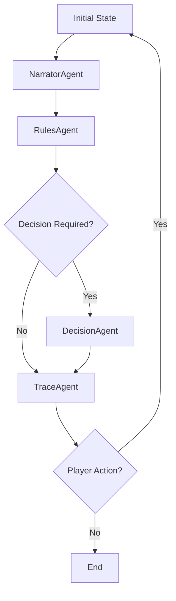

# 🎲 Casys RPG - Interactive Game Book Engine

[](https://www.python.org/downloads/)
[](https://streamlit.io)
[](https://openai.com/)
[](https://coverage.readthedocs.io/)
[](LICENSE)
[](https://github.com/psf/black)
[](https://github.com/Casys-AI/casys-rpg/graphs/commit-activity)

<div align="center">

🎮 A modern AI-powered engine for interactive game books, leveraging LLM agents for intelligent rule management and decision-making.

[Features](#features) •
[Quick Start](#quick-start) •
[Architecture](#architecture) •
[Documentation](#documentation)

</div>

---

## ✨ Features

- 🤖 **Intelligent Agents**: 
  - NarratorAgent: Content management and formatting
  - RulesAgent: Rule analysis and conditions with RAG
  - DecisionAgent: Choice validation and transition management
  - TraceAgent: Complete history and player statistics

- 🎲 **Dynamic Dice System**:
  - Rule-based contextual rolls
  - Specialized types: combat, chance, normal
  - Result validation and impacts
  - Intuitive interface with dynamic buttons

- 📊 **Stats Management**:
  - Characteristics: Skill, Luck, Endurance
  - Resources: Gold, Gems
  - Dynamic inventory with equipment
  - Automatic progress saving

- 🔄 **State Management**:
  - EventBus for asynchronous communication
  - Automatic save/load
  - Detailed action history
  - Complete game tracing

- 🎨 **User Interface**:
  - Current version: Modern Streamlit interface
  - In development: Qwik Frontend for enhanced reactivity
  - Adaptive dark/light theme
  - Responsive design

## 🚀 Quick Start

### Prerequisites

- Python 3.8+
- pip
- OpenAI API key
- Git

### Installation

1. Clone the repository:
```bash
git clone https://github.com/your-repo/casys-rpg.git
cd casys-rpg
```

2. Create a virtual environment:
```bash
python -m venv .venv
source .venv/bin/activate  # Linux/Mac
.venv\Scripts\activate     # Windows
```

3. Install dependencies:
```bash
pip install -r requirements.txt
```

4. Configure environment:
```bash
cp .env.example .env
# Edit .env with your OpenAI API key
```

5. Run the application:
```bash
streamlit run app.py
```

## 🏗 Architecture

### Agent Workflow



### EventBus

The system uses a central EventBus for:
- Asynchronous agent communication
- State update propagation
- Game event management
- Player action synchronization

```python
# EventBus usage example
await event_bus.emit(Event(
    type="state_updated",
    data={"action": "dice_roll", "result": 6}
))
```

### Core Components

1. **StoryGraph** (`agents/story_graph.py`):
   - Game flow orchestration
   - Agent coordination via EventBus
   - State transition management
   - Action validation

2. **Agents** (`agents/`):
   - `narrator_agent.py`: Content and formatting
   - `rules_agent.py`: RAG rule analysis
   - `decision_agent.py`: Decision logic
   - `trace_agent.py`: History and stats

3. **EventBus** (`event_bus.py`):
   - Inter-agent communication
   - Event management
   - State updates
   - Synchronization

### Data Structure

```
.
├── agents/                 # Specialized agents
├── data/
│   ├── sections/          # Narrative content
│   ├── rules/            # Game rules
│   └── trace/            # Session data
│       ├── history.json  # Action history
│       └── stats.json    # Player stats
├── frontend/             # Qwik UI (in dev)
└── app.py               # Streamlit interface
```

## 📚 Documentation

### LLM Models
- Using `gpt-4o-mini`
- Agent configurations:
  - NarratorAgent: temp=0.7
  - RulesAgent: temp=0
  - DecisionAgent: temp=0.7

### Rule Format
```markdown
# Section X
- Conditions: [condition1, condition2]
- Actions: [action1, action2]
- Next sections: [Y, Z]
```

### Game State
```python
{
    "section_number": int,
    "content": str,
    "decision": {
        "next_section": int,
        "awaiting_action": bool,
        "conditions": List[str]
    },
    "trace": {
        "history": List[Dict],
        "stats": Dict
    }
}
```

## 🔄 Roadmap

- [x] Functional Streamlit version
- [x] Dynamic dice system
- [x] Stats management
- [x] Action history
- [-] Hybrid Agentic architecture
- [ ] Fast API backend
- [ ] Qwik Frontend
- [ ] Image integration
- [ ] Visual rule editor


---

<div align="center">
Made with ❤️ by Casys AI Team
</div>
