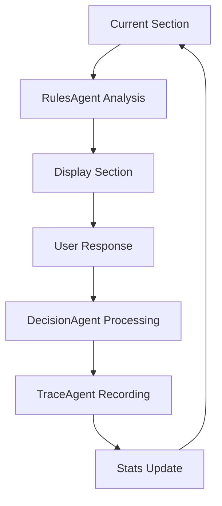

# 🎲 Casys RPG - Interactive Game Book Engine

[](https://www.python.org/downloads/)
[](https://streamlit.io)
[](https://openai.com/)
[](LICENSE)
[](https://github.com/psf/black)
[](https://github.com/Casys-AI/casys-rpg/graphs/commit-activity)

<div align="center">

🎮 A modern AI-powered engine for interactive game books, leveraging LLM agents for intelligent rule management and decision-making.

[Features](#features) •
[Quick Start](#quick-start) •
[Architecture](#architecture) •
[Documentation](#documentation) •
[Contributing](#contributing)

</div>

---

## ✨ Features

- 🤖 **Intelligent Agents**: Four specialized LLM agents handling different aspects of the game
- 📚 **RAG-based Rules**: Semantic search and analysis of game rules using FAISS
- 🎲 **Dynamic Dice System**: Context-aware dice rolling system for combat and chance events
- 📊 **Character Stats**: Real-time character statistics tracking
- 🔄 **Game State Management**: Robust state management with save/load capabilities
- 📝 **Feedback System**: Integrated user feedback collection
- 🐛 **Debug Mode**: Built-in debugging tools for development

## 🚀 Quick Start

### Prerequisites

- Python 3.8+
- pip
- OpenAI API key
- langgraph
- faiss-cpu

### Installation

```bash
# Install dependencies
pip install -r requirements.txt

# Set up environment
cp .env.example .env
# Edit .env with your OpenAI API key
```

### Running the Game

```bash
streamlit run app.py
```

## 🏗 Architecture

The system utilizes four specialized LangChain agents:

### 1. RulesAgent 📋
- Implements RAG for rule analysis
- FAISS indexing for semantic search
- Determines dice roll requirements
- Returns structured analysis:
  ```json
  {
    "needs_dice_roll": true|false,
    "dice_type": "chance"|"combat"|null,
    "conditions": ["condition1", "condition2"],
    "next_sections": [1, 2, 3],
    "rules_summary": "Rules summary"
  }
  ```

### 2. DecisionAgent 🤔
- Interprets user responses
- Processes RulesAgent analysis
- Manages dice roll button display
- Validates section choices
- Focuses on decision logic

### 3. NarratorAgent 📖
- Reads book sections
- Formats text for display
- Manages content presentation
- Handles section transitions

### 4. TraceAgent 📝
- Records decisions with context
- Maintains game history
- Enables game state recovery
- Stores character statistics

## 🧩 Core Components

### 1. Application (app.py)
- Streamlit UI interface
- Session state management
- Character statistics display
- Interactive game controls:
  - Dynamic dice roll button
  - Feedback system
  - Debug mode
- Integrated feedback form

### 2. Game Logic (game_logic.py)
- GameState class management
- Agent coordination
- Error handling and logging
- StoryGraph interface

### 3. Utilities (utils/game_utils.py)
- Dice rolling functions
- Data manipulation tools
- Common helper functions

## 🔄 Game Flow



## 📁 Project Structure

```
.
├── agents/
│   ├── rules_agent.py     # RAG + Rule analysis
│   ├── decision_agent.py  # Decision logic
│   ├── narrator_agent.py  # Content reading
│   ├── trace_agent.py     # History & stats
│   └── story_graph.py     # Coordination
├── utils/
│   └── game_utils.py      # Common utilities
├── data/
│   ├── sections/          # Book text
│   ├── rules/            # Section rules
│   ├── trace/            # Game history
│   └── feedback/         # User feedback
├── tests/
│   ├── test_story_graph.py # StoryGraph tests
│   ├── test_agents.py     # Agent tests
│   └── TESTS.md          # Test documentation
├── app.py                # Streamlit interface
├── game_logic.py         # Core logic
└── requirements.txt      # Dependencies
```

## 📚 Documentation

### LLM Models
- Using `gpt-4o-mini` for all agents
- Temperature settings:
  - RulesAgent: 0 (deterministic)
  - DecisionAgent: 0.7 (controlled creativity)
  - NarratorAgent: 0.3 (balanced)
  - TraceAgent: 0 (deterministic)

### Vector Index
- FAISS with L2 metric
- Dimension: 1536 (OpenAI embeddings)
- Updates: On each launch
- Cache mechanism for frequent queries

### Rule Format
- Markdown files
- One file per section: `section_X_rule.md`
- Structure:
  ```markdown
  # Section X Rules
  - Conditions: [...]
  - Possible actions: [...]
  - Next sections: [...]
  ```

## 🧪 Testing

### Test Architecture
Each component has its own test suite focusing on specific functionalities:

### 1. StoryGraph Tests
- **Initial State**: Game loading and setup
- **User Response**: Choice validation
- **Dice System**: Roll mechanics
- **Error Handling**: System robustness
- **Event System**: Communication flow
- **State Management**: Data consistency

### 2. Agent Tests
- **RulesAgent**:
  - Rule parsing accuracy
  - Cache effectiveness
  - Search relevance
  - Error handling
  
- **DecisionAgent**:
  - Choice validation
  - State transitions
  - Action triggers
  - Error recovery
  
- **NarratorAgent**:
  - Content loading
  - Format consistency
  - Cache management
  - Error states
  
- **TraceAgent**:
  - History tracking
  - State persistence
  - Event logging
  - Recovery mechanisms

### Running Tests
```bash
# Run all tests
pytest

# Run specific test suite
pytest tests/test_story_graph.py

# Run with coverage
pytest --cov=agents tests/
```

### Test Categories

#### 1. Unit Tests
- Individual agent testing
- Function-level validation
- Error case handling
- State management

#### 2. Integration Tests
- Agent interaction testing
- Event system validation
- State transitions
- Error propagation

#### 3. End-to-End Tests
- Complete game flow testing
- User interaction simulation
- State persistence
- Performance metrics

### Test Dependencies
- pytest-asyncio: Async test execution
- pytest-cov: Coverage reporting
- pytest-mock: Mocking framework
- pytest-benchmark: Performance testing

For detailed test documentation, see [TESTS.md](tests/TESTS.md).

## 🔄 Version History

### v1.2.0 (15/12/2023)
- Enhanced error handling
- Test suite refactoring
- Documentation updates
- Performance improvements

### v1.1.0 (15/12/2023)
- MockEventBus introduction
- Assertion improvements
- Test robustness
- Bug fixes

### v1.0.0 (15/12/2023)
- Initial release
- Basic functionality
- Core test suite
- Documentation

## 🤝 Contributing

Contributions are welcome! See [CONTRIBUTING.md](CONTRIBUTING.md) for guidelines.

## 📄 License

This project is licensed under the MIT License - see the [LICENSE](LICENSE) file for details.

## 🙏 Acknowledgments

- OpenAI for GPT models
- Streamlit team for the framework
- LangChain community for agent framework
- FAISS team for vector search

---

<div align="center">
Made with ❤️ by Casys AI Team
</div>
