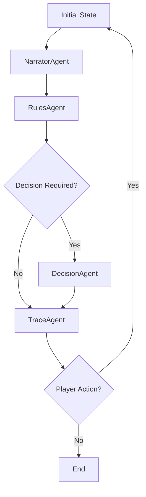

# 🎲 Casys RPG - Interactive Game Book Engine

[](https://www.python.org/downloads/)
[](https://streamlit.io)
[](https://openai.com/)
[](https://coverage.readthedocs.io/)
[](LICENSE)
[](https://github.com/psf/black)
[](https://github.com/Casys-AI/casys-rpg/graphs/commit-activity)

<div align="center">

🎮 A modern AI-powered engine for interactive game books, leveraging LLM agents for intelligent rule management and decision-making.

[Features](#features) •
[Quick Start](#quick-start) •
[Architecture](#architecture) •
[Documentation](#documentation) •
[Contributing](#contributing)

</div>

---

## ✨ Features

### 🤖 Agent System
- **NarratorAgent**: 
  - Content formatting and presentation
  - Dynamic text adaptation
  - Context-aware descriptions
  - Markdown support

- **RulesAgent**: 
  - RAG-based rule analysis
  - FAISS vector indexing
  - Condition validation
  - Semantic rule search

- **DecisionAgent**: 
  - Choice validation
  - State transitions
  - Action management
  - Context-aware decisions

- **TraceAgent**: 
  - Complete history tracking
  - Statistics management
  - Save/load functionality
  - Analytics support

### 🎲 Game Mechanics
- **Dynamic Dice System**:
  - Multiple dice types (d4, d6, d8, d10, d12, d20)
  - Context-aware roll requirements
  - Combat and chance rolls
  - Result validation

- **Character Management**:
  - Core stats (Skill, Stamina, Luck)
  - Inventory system
  - Equipment tracking
  - Resource management

### 🔄 State & Events
- **EventBus**:
  - Asynchronous communication
  - Event-driven architecture
  - State synchronization
  - Action coordination

- **Game State**:
  - Persistent storage
  - Automatic backups
  - History tracking
  - Recovery options

### 🎨 Frontend
- **Current UI (Streamlit)**:
  - Responsive design
  - Dark/light themes
  - Interactive components
  - Real-time updates

- **Future UI (Qwik)**:
  - Enhanced reactivity
  - Modern components
  - Better performance
  - Improved UX

## 🚀 Quick Start

### Prerequisites
- Python 3.8+
- pip
- OpenAI API key
- Git

### Installation

1. **Clone the repository**:
   ```bash
   git clone https://github.com/Casys-AI/casys-rpg.git
   cd casys-rpg
   ```

2. **Set up virtual environment**:
   ```bash
   python -m venv .venv
   source .venv/bin/activate  # Linux/Mac
   .venv\Scripts\activate     # Windows
   ```

3. **Install dependencies**:
   ```bash
   pip install -r requirements.txt
   ```

4. **Configure environment**:
   ```bash
   cp .env.example .env
   # Edit .env with your configuration
   ```

5. **Run the application**:
   ```bash
   streamlit run app.py
   ```

## 🏗 Architecture

### Core Components

```
casys-rpg/
├── agents/                 # AI Agents
│   ├── base_agent.py      # Base agent class
│   ├── narrator_agent.py  # Content management
│   ├── rules_agent.py     # Rule processing
│   ├── decision_agent.py  # Choice handling
│   ├── trace_agent.py     # History tracking
│   └── story_graph.py     # Flow coordination
├── managers/              # System Managers
│   ├── cache_manager.py   # Content caching
│   ├── game_managers.py   # Game coordination
│   └── stats_manager.py   # Statistics
├── data/                  # Game Data
│   ├── sections/         # Story content
│   ├── rules/           # Game rules
│   └── trace/           # Game history
├── frontend/             # UI Components
│   └── src/             # Frontend source
├── tests/               # Test Suite
│   ├── docs/           # Test documentation
│   └── test_*.py       # Test files
└── app.py              # Main application
```

### Agent Workflow



### State Management

```python
GameState = {
    "section": {
        "number": int,
        "content": str,
        "choices": List[str]
    },
    "rules": {
        "needs_dice": bool,
        "dice_type": str,
        "conditions": List[str],
        "next_sections": List[int]
    },
    "player": {
        "stats": Dict[str, int],
        "inventory": List[str],
        "history": List[Dict]
    }
}
```

## 📚 Documentation

### Configuration

The `.env` file controls various aspects:
```env
# API Configuration
OPENAI_API_KEY=your_key_here
OPENAI_MODEL=gpt-4o-mini

# Application Settings
DEBUG=False
LOG_LEVEL=INFO
CACHE_ENABLED=True

# Data Paths
DATA_DIR=data
SECTIONS_DIR=data/sections
RULES_DIR=data/rules
```

### Testing

Run the test suite:
```bash
# Run all tests
pytest

# Run with coverage
pytest --cov=. --cov-report=term-missing

# Run specific test
pytest tests/test_rules_agent.py
```

Current coverage by module:
- base_agent: 80%
- decision_agent: 75%
- narrator_agent: 53%
- rules_agent: 48%
- story_graph: 44%
- trace_agent: 68%

### Development Guidelines

1. **Code Style**:
   - Follow Black formatting
   - Use type hints
   - Document all functions
   - Write comprehensive tests

2. **Git Workflow**:
   - Feature branches
   - Descriptive commits
   - PR reviews
   - Version tags

3. **Documentation**:
   - Update README
   - Maintain test docs
   - Comment complex logic
   - Keep API docs current

## 🔄 Roadmap

### Completed
- [x] Core agent system
- [x] Basic game mechanics
- [x] Streamlit interface
- [x] Test documentation
- [x] State management

### In Progress
- [-] FastAPI backend
- [-] Qwik frontend
- [ ] Enhanced RAG
- [ ] Combat system

### Planned
- [ ] Multi-language support
- [ ] Custom rule editor
- [ ] Advanced analytics
- [ ] Mobile optimization

## 🤝 Contributing

1. Fork the repository
2. Create a feature branch
3. Make your changes
4. Submit a pull request

See [CONTRIBUTING.md](CONTRIBUTING.md) for detailed guidelines.

## 📄 License

This project is licensed under the MIT License - see the [LICENSE](LICENSE) file for details.

---

<div align="center">
Made with ❤️ by the Casys AI Team
</div>
