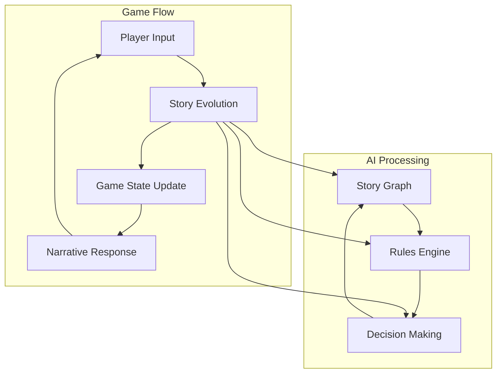

# 🧠 CASYS - Complex Adaptive Systems of AI

[](https://www.python.org/downloads/)
[](https://fastapi.tiangolo.com)
[](https://openai.com/)
[](https://coverage.readthedocs.io/)
[](LICENSE)
[](https://github.com/psf/black)
[](https://github.com/Casys-AI/casys-rpg/graphs/commit-activity)

<div align="center">

🤖 A neurosymbolic framework orchestrating LLMs and rule-based agents through formalized graph-based cognitive workflows.

[Documentation](https://www.casys.ai) •
[Quick Start](#quick-start) •
[Contributing](#contributing)

</div>

---

## 🔄 System Overview



## ✨ Structure and Orchestration

## 🛠 System Requirements

### Python Compatibility
- **Recommended**: Python 3.11 or 3.12
- **Note**: While the project can run on Python 3.13, you might encounter some dependency installation issues with poetry. In this case, it's recommended to:
  1. Use pip for installing numpy and other compiled packages
  2. Use the provided `freeze-requirements.txt` for consistent dependency management
  3. Consider using Python 3.11 or 3.12 for the best development experience

### Dependencies
The project uses several key dependencies:
- FastAPI for the web framework
- Langchain & Langgraph for AI orchestration
- OpenAI for LLM integration
- Numpy for numerical operations

<div align="center">

### 🔄 Logical Structure
| Feature | Description |
|---------|-------------|
| Graph-based | Representation of critical steps |
| Node System | Embodying logic and processing |
| Auto-generation | From structured knowledge |
| Dual Support | Narrative and technical nodes |
| Integration | With existing documentation |

### 🤖 Agent Orchestration
| Feature | Description |
|---------|-------------|
| Contextual | Invocation of appropriate agents |
| State Sharing | For decision coherence |
| Hybrid Approach | Blend of symbolic and neural |
| Real-time | Agent coordination |
| Extensible | Agent architecture |

</div>

## 🎯 Core Features

<div align="center">

### 📊 Graphical Workflows
| Component | Purpose |
|-----------|----------|
| Rules | Business rules and conditions |
| LLM | Interaction points |
| Input | User input handlers |
| State | Transitions and tracking |
| History | Decision tracking |

### 💾 State Management
| Feature | Implementation |
|---------|----------------|
| State | Immutable with Pydantic v2 |
| Actions | Complete traceability |
| Events | Asynchronous handling |
| Cache | In-memory optimization |
| History | Decision tracking |

</div>

## 🚀 Applications

<div class="grid" style="display: grid; grid-template-columns: repeat(3, 1fr); gap: 20px; padding: 20px;">

<div style="border: 1px solid #ddd; padding: 15px; border-radius: 8px;">

### 📚 Interactive Storytelling
- Nodes describe key moments
- LLM narrator for descriptions
- Decision agent guidance
- Player-driven choices

</div>

<div style="border: 1px solid #ddd; padding: 15px; border-radius: 8px;">

### 🔧 Industrial Diagnostics
- Rule-based verification
- LLM log interpretation
- Automated routing
- Compliance tracking

</div>

<div style="border: 1px solid #ddd; padding: 15px; border-radius: 8px;">

### 🌲 Branching Processes
- Training programs
- Security audits
- Intelligent checklists
- Process automation

</div>

</div>

## 🛠 Quick Start

```bash
# Clone the repository
git clone https://github.com/Casys-AI/casys-rpg.git
cd casys-rpg

# Install dependencies
pip install -r requirements.txt

# Run the demo RPG application
python -m casys_rpg
```

## 🤝 Contributing

We welcome contributions! Please check our [Contributing Guide](https://www.casys.ai/contributing) for guidelines.

## 📖 Documentation

For detailed documentation, visit [www.casys.ai](https://www.casys.ai)

## 📄 License

This project is licensed under the MIT License - see the [LICENSE](LICENSE) file for details.