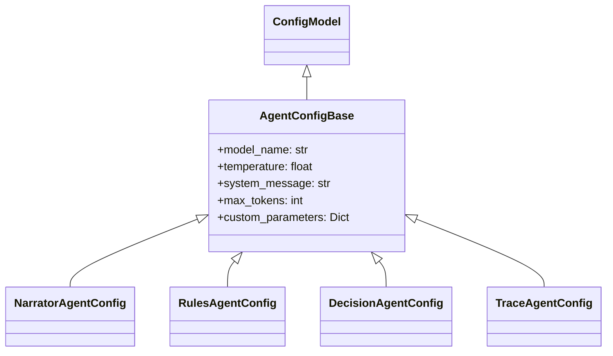

# Agent Configuration System

This document details the configuration system for Casys RPG agents.

## Configuration Hierarchy

The agent configuration system follows a hierarchical structure:



## Base Configuration

The `AgentConfigBase` class provides common configuration parameters for all agents:

```python
class AgentConfigBase(ConfigModel):
    model_name: str          # LLM model name
    temperature: float       # Temperature for responses
    system_message: str      # System message for LLM
    max_tokens: Optional[int]  # Maximum tokens
    custom_parameters: Dict[str, Any]  # Agent-specific parameters
```

## Specialized Configurations

### NarratorAgentConfig
- **Model**: `ModelType.NARRATOR` (gpt-4o-mini)
- **Purpose**: Content formatting and presentation
- **Key Features**:
  - Detailed system message for markdown formatting
  - Section formatting guidelines
  - Choice number formatting rules

### RulesAgentConfig
- **Model**: `ModelType.RULES` (gpt-4o-mini)
- **Temperature**: 0.0 (deterministic)
- **Purpose**: Rules analysis and interpretation
- **Key Features**:
  - JSON structure for rules output
  - Dice roll analysis
  - Condition extraction

### DecisionAgentConfig
- **Model**: `ModelType.DECISION` (gpt-4o-mini)
- **Temperature**: 0.7 (creative)
- **Purpose**: Decision making and choice validation
- **Key Features**:
  - Choice validation settings
  - Strict mode options
  - Decision parameters

### TraceAgentConfig
- **Model**: `ModelType.TRACE` (gpt-4o-mini)
- **Purpose**: History and statistics tracking
- **Key Features**:
  - Event tracking parameters
  - Statistics analysis settings

## Usage in GameFactory

The GameFactory creates agents with their specific configurations:

```python
class GameFactory:
    def __init__(self, config: GameConfig):
        self._config = config
        self._llm = self._create_llm()

    def _create_llm(self) -> ChatOpenAI:
        return ChatOpenAI(
            model=self._config.model_type.value,
            temperature=self._config.temperature
        )
```

## Configuration Flow

1. **Default Configuration**:
   - Each agent has default values in its config class
   - Environment variables can override defaults
   - GameConfig provides global defaults

2. **Configuration Loading**:
   - GameFactory loads the main configuration
   - Each agent receives its specific config
   - Managers receive storage configuration

3. **Runtime Updates**:
   - Some parameters can be updated during runtime
   - Changes are validated through Pydantic

## Best Practices

1. **Configuration Inheritance**:
   - Always inherit from AgentConfigBase
   - Override only necessary parameters
   - Keep defaults in constants

2. **Type Safety**:
   - Use Pydantic for validation
   - Define clear parameter types
   - Use enums for fixed choices

3. **Documentation**:
   - Document all configuration parameters
   - Explain parameter impacts
   - Provide usage examples

## Example: Creating Custom Agent Config

```python
from config.agents.agent_config_base import AgentConfigBase

class CustomAgentConfig(AgentConfigBase):
    custom_parameter: str = Field(
        default="default_value",
        description="Custom parameter description"
    )
    
    temperature: float = Field(
        default=0.5,
        description="Custom temperature for this agent"
    )
```
