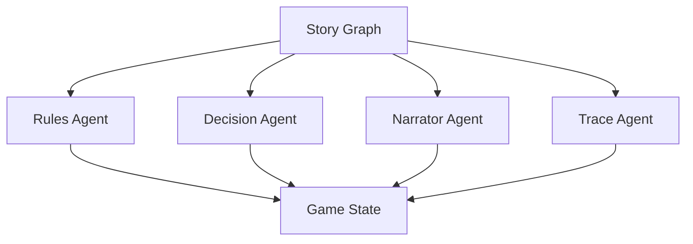

# Agents Overview

The Casys RPG engine uses a sophisticated multi-agent system powered by LangChain. Each agent is specialized in a specific aspect of the game, working together to create an immersive and dynamic gaming experience.

## Agent Architecture

The system is built around four core agents:

## Core Agents

### Rules Agent
- Implements RAG (Retrieval Augmented Generation)
- Manages game rules and mechanics
- Determines dice roll requirements
- Validates player actions

### Decision Agent
- Interprets user responses
- Processes game logic
- Manages choice validation
- Controls game flow

### Narrator Agent
- Presents game content
- Formats text for display
- Manages narrative flow
- Handles content presentation

### Trace Agent
- Records game history
- Maintains player statistics
- Enables state recovery
- Tracks game progression

## Agent Coordination

The agents are coordinated through the `AgentManager` class, which:
1. Manages user interactions and requests
2. Coordinates game state and progression
3. Handles errors and provides feedback
4. Manages game sessions

## Communication Protocol

Agents communicate through well-defined protocols:
- `StoryGraphProtocol`: Manages overall game flow
- `NarratorAgentProtocol`: Handles content presentation
- `RulesAgentProtocol`: Manages game rules
- `DecisionAgentProtocol`: Handles decision logic
- `TraceAgentProtocol`: Manages game history
