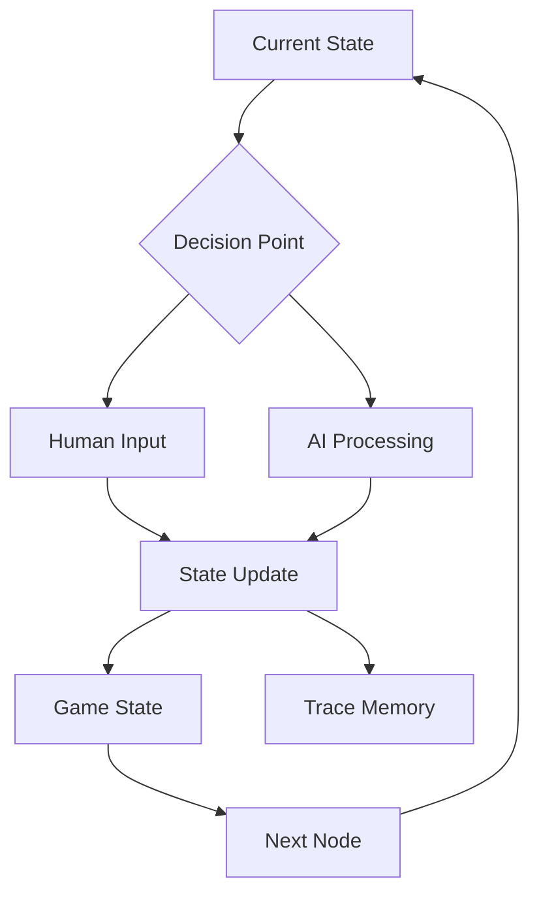

# Cognitive Iteration Loop

The heart of CASYS RPG is its cognitive iteration loop - a sophisticated cycle that combines user interaction, AI processing, and state management to create a dynamic storytelling experience.

## Overview



## Components of the Loop

### 1. Current State Processing
- **Story Node**: Current position in the narrative graph
- **GameState**: Complete game state including:
    - Character attributes
    - Inventory
    - Quest progress
    - Environmental conditions

### 2. Decision Point Analysis
The system evaluates the current situation and determines the next action:

- **Human-in-the-loop**: When user input/feedback is required
- **AI Processing**: When automated decision-making or content generation is needed

### 3. Processing Paths

#### Human Interaction Path
- Presents situation to user
- Collects user input
- Validates input against game rules
- Processes user decisions

#### AI Subsystem Path
- **RulesAgent**: Interprets and applies game rules
- **NarratorAgent**: Generates narrative content
- **DecisionAgent**: Makes automated decisions
- **TraceAgent**: Updates history and statistics

### 4. State Update
- Updates GameState based on:
    - User actions
    - AI computations
    - Rule applications
- Maintains state immutability using Pydantic v2
- Triggers necessary side effects

### 5. Trace Memory
- Records all significant events
- Maintains action history
- Updates character statistics
- Stores narrative context

### 6. Next Node Selection
- Determines the next story node based on:
    - Current state
    - User choices
    - AI decisions
    - Game rules

## Implementation Example

```python
async def cognitive_loop(
    story_graph: StoryGraph,
    game_state: GameState,
    trace_memory: TraceMemory
) -> AsyncGenerator[GameState, None]:
    """
    Main cognitive iteration loop of the CASYS RPG engine.
    """
    current_node = story_graph.get_current_node()
    
    while True:
        # Process current situation
        decision = await analyze_situation(current_node, game_state)
        
        if decision.requires_human_input:
            # Human-in-the-loop path
            user_response = await get_user_input(decision.context)
            result = await process_user_response(user_response)
        else:
            # AI subsystem path
            result = await process_ai_subsystem(decision.context)
            
        # Update state and memory
        new_state = await update_game_state(game_state, result)
        await trace_memory.record(result.events)
        
        # Determine next node
        next_node = await story_graph.get_next_node(new_state)
        current_node = next_node
        
        yield new_state
```

## Key Benefits

1. **Flexibility**: Seamlessly handles both user interaction and AI processing
2. **Maintainability**: Clear separation of concerns between components
3. **Traceability**: Complete history of actions and decisions
4. **Scalability**: Easy to add new processing paths or decision types
5. **Reliability**: Immutable state management prevents side effects

## Best Practices

1. **State Management**
   - Always use immutable state updates
   - Validate state transitions
   - Maintain state history

2. **Error Handling**
   - Graceful fallbacks for AI processing
   - Clear user feedback
   - State recovery mechanisms

3. **Performance**
   - Optimize state updates
   - Cache frequently accessed data
   - Asynchronous processing where possible

4. **Testing**
   - Unit tests for each component
   - Integration tests for complete loops
   - Simulation testing for complex scenarios
