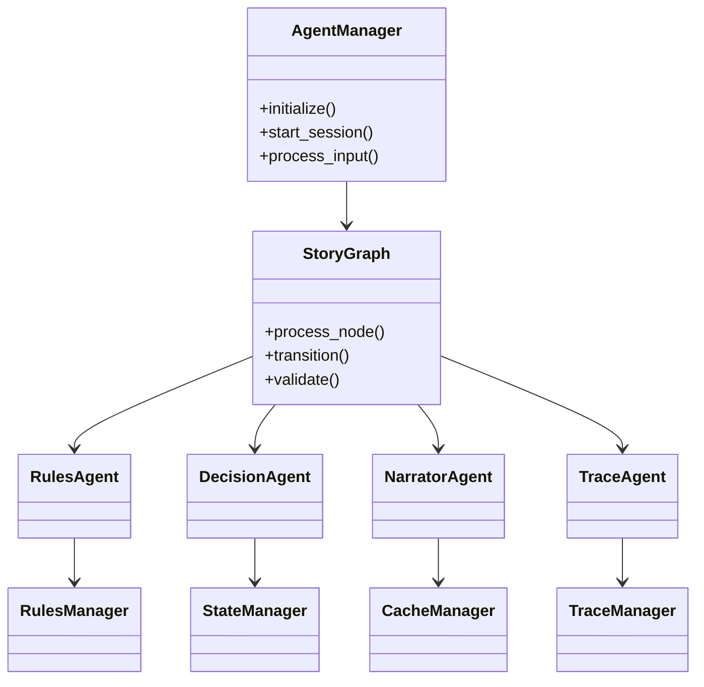

# System Components

This document details the core components of the Casys RPG system and their interactions.

## Component Overview



## Core Components

### 1. Agent Manager
The central coordinator for the entire system.

**Responsibilities:**
- User interaction handling
- Session management
- Error handling
- Agent coordination

**Key Methods:**
```python
class AgentManager:
    async def initialize_game()
    async def process_user_input()
    async def handle_error()
```

### 2. Story Graph
Controls game flow and agent coordination.

**Responsibilities:**
- Game flow management
- State transitions
- Agent coordination
- Event sequencing

**Key Methods:**
```python
class StoryGraph:
    async def process_node()
    async def transition()
    async def validate_transition()
```

### 3. Managers

#### Rules Manager
Handles game rules and their application.

**Features:**
- Rule storage
- FAISS indexing
- Rule retrieval
- Rule validation

#### State Manager
Manages game state and transitions.

**Features:**
- State persistence
- State validation
- State recovery
- History tracking

#### Cache Manager
Handles content caching and retrieval.

**Features:**
- Content caching
- Cache invalidation
- Performance optimization
- Memory management

#### Trace Manager
Manages game history and analysis.

**Features:**
- History tracking
- State analysis
- Feedback generation
- Progress monitoring

## Data Models

### 1. Game State
```python
class GameState:
    section_number: int
    player_input: Optional[str]
    decision: Optional[DecisionModel]
    rules: Optional[RulesModel]
    trace: Optional[TraceModel]
```

### 2. Rules Model
```python
class RulesModel:
    needs_dice_roll: bool
    dice_type: Optional[str]
    conditions: List[str]
    next_sections: List[int]
```

### 3. Decision Model
```python
class DecisionModel:
    section_number: int
    analysis: str
    conditions: List[str]
```

### 4. Trace Model
```python
class TraceModel:
    timestamp: datetime
    actions: List[Dict]
    insights: Optional[Dict]
```

## Component Interactions

### 1. Input Processing Flow
1. User input received by AgentManager
2. Input validated and processed
3. State updated via StateManager
4. Rules checked via RulesAgent
5. Decision made via DecisionAgent
6. Content presented via NarratorAgent
7. History updated via TraceAgent

### 2. State Management Flow
1. State changes triggered
2. State validated
3. Changes persisted
4. History updated
5. Cache updated

### 3. Rule Processing Flow
1. Rules retrieved
2. Context analyzed
3. Decisions validated
4. State updated
5. History recorded

## Configuration

Each component is configurable through:

### 1. Environment Variables
```bash
OPENAI_API_KEY=your_key
DEBUG_MODE=true
CACHE_TTL=3600
```

### 2. Configuration Files
```python
class AgentConfig:
    model_name: str
    temperature: float
    debug: bool
```

### 3. Runtime Settings
```python
agent_manager.update_config({
    "debug": True,
    "cache_enabled": True
})
```

## Error Handling

Components implement comprehensive error handling:

### 1. Error Types
- ValidationError
- StateError
- RuleError
- AgentError

### 2. Recovery Mechanisms
- State rollback
- Cache recovery
- Error logging
- User feedback

## Performance Optimization

Components implement various optimizations:

### 1. Caching
- Content caching
- Rule caching
- State caching

### 2. Batch Processing
- Rule analysis
- State updates
- History recording

### 3. Async Operations
- User input processing
- State updates
- Content retrieval
