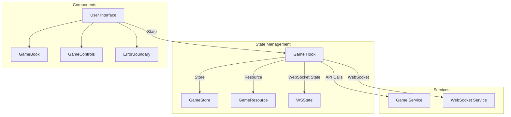

# Frontend Architecture

Ce document détaille l'architecture frontend de Casys RPG, basée sur Qwik.

## Architecture Overview



## Core Principles

### 1. Sérialisation Qwik
- Utilisation exclusive d'objets sérialisables
- Éviter les classes et instances
- Préférer les fonctions pures et les objets simples

### 2. State Management
- Utilisation de `useStore` pour l'état global
- `useResource$` pour les chargements asynchrones
- `useTask$` pour les effets de bord
- État WebSocket séparé du state principal

### 3. Services
Les services sont implémentés comme des objets avec des fonctions pures :

```typescript
// Exemple de service
export const gameService = {
  getGameState: async (sessionId: string, gameId: string) => {
    // Implementation
  },
  // Autres méthodes...
};
```

## Components

### Game Hook (useGame)
Hook principal qui gère l'état du jeu :

```typescript
export const useGame = () => {
  // État WebSocket
  const wsConnected = useSignal(false);
  const wsError = useSignal<string | null>(null);
  
  // Store principal
  const store = useStore<GameStore>({...});
  
  // Resource pour le chargement
  const gameResource = useResource$<GameState>(...);
  
  // Actions
  const actions = {...};
  
  return { store, wsConnected, wsError, actions, gameResource };
};
```

### Services

#### Game Service
Gère les appels API :
- Chargement de l'état
- Actions du jeu
- Lancer de dés

#### WebSocket Service
Gère les connexions WebSocket :
- Connexion/déconnexion
- Envoi de messages
- Gestion des erreurs

## State Management

### Game Store
```typescript
interface GameStore {
  sessionId: string | null;
  gameId: string | null;
  state: GameState | null;
  isLoading: boolean;
  error: string | null;
  currentRoute: string;
  theme: 'light' | 'dark';
}
```

### WebSocket Management
La gestion WebSocket est encapsulée dans le service pour éviter les problèmes de sérialisation :

```typescript
// Service WebSocket
let wsInstance: WebSocket | null = null; // Variable module-level

export const websocketService = {
  isConnected: () => wsInstance?.readyState === WebSocket.OPEN,
  connect: (handlers: WebSocketHandlers) => { ... },
  send: (data: unknown) => { ... },
  disconnect: () => { ... }
};
```

Dans le hook, on utilise uniquement des signaux pour l'état :
```typescript
// Signaux WebSocket dans le hook
const wsConnected = useSignal(false);
const wsError = useSignal<string | null>(null);
```

Cette approche offre plusieurs avantages :
- Instance WebSocket gérée en interne par le service
- Pas de problèmes de sérialisation
- Interface simple et claire
- Meilleure séparation des responsabilités

## Best Practices

### 1. Sérialisation
- ✅ Gérer les instances non sérialisables dans les services
- ✅ Utiliser des signaux uniquement pour les états primitifs
- ✅ Encapsuler la logique WebSocket
- ❌ Ne pas stocker d'instances de classe dans les stores ou signaux

### 2. State Management
- ✅ Utiliser useStore pour l'état global
- ✅ useResource$ pour les chargements
- ✅ useTask$ pour les effets
- ❌ Éviter useVisibleTask$ si possible

### 3. Services
- ✅ Fonctions pures
- ✅ Objets simples
- ✅ Gestion d'erreurs explicite
- ❌ Pas de state interne

### 4. Composants
- ✅ Composants légers et focalisés
- ✅ Props typés
- ✅ Gestion d'erreurs avec ErrorBoundary
- ❌ Pas de logique métier dans les composants

## Configuration

### API Config
```typescript
const API_CONFIG = {
  BASE_URL: string;
  WS_URL: string;
  DEFAULT_HEADERS: Record<string, string>;
  ROUTES: ApiRoutes;
};
```

### Routes
```typescript
const API_ROUTES = {
  GAME: {
    INITIALIZE: string;
    ACTION: string;
    STATE: string;
    // ...
  },
  // ...
};
```

## Error Handling

1. **Services**
   - Erreurs typées
   - Messages d'erreur explicites
   - Pas de logging dans les services

2. **Hook**
   - Centralisation des erreurs
   - État d'erreur dans le store
   - Gestion séparée des erreurs WebSocket

3. **UI**
   - Composant ErrorBoundary
   - Messages utilisateur traduits
   - Feedback visuel

## Performance

1. **Optimisations**
   - Resources pour le chargement asynchrone
   - Gestion efficace du state
   - Minimisation des re-renders

2. **Caching**
   - Cache des ressources statiques
   - Optimisation des routes
   - Gestion du service worker

## Testing

1. **Unit Tests**
   - Services
   - Hooks
   - Utils

2. **Integration Tests**
   - Flux complets
   - WebSocket
   - State management

3. **E2E Tests**
   - Parcours utilisateur
   - Gestion des erreurs
   - Performance
