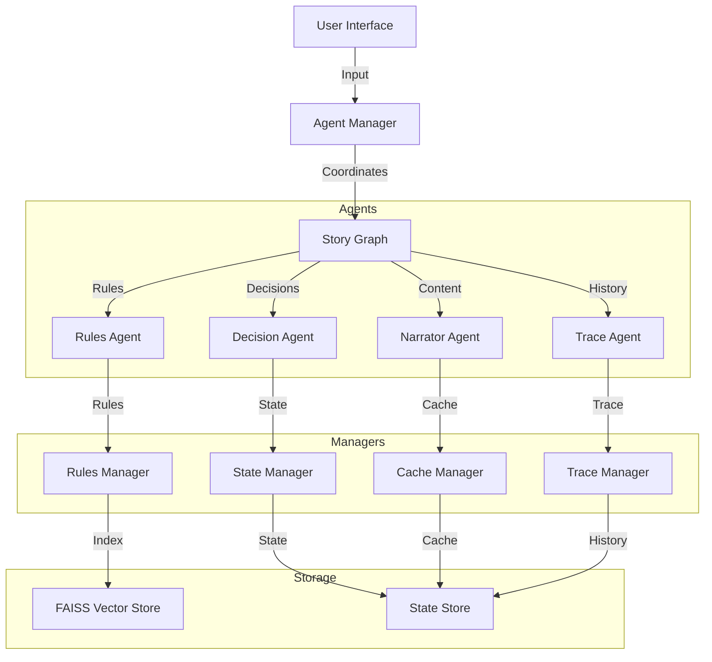

# Architecture Overview

Casys RPG is built on a modular, event-driven architecture that leverages LangChain for agent coordination and FAISS for efficient rule retrieval.

## System Architecture

## Core Components

### 1. Agent Manager
- Central coordinator for all system components
- Manages user interactions and requests
- Handles session management
- Provides error handling and feedback

### 2. Story Graph
- Controls game flow and progression
- Coordinates agent interactions
- Manages state transitions
- Handles event sequencing

### 3. Agents
Each agent is specialized for a specific aspect of the game:
- **Rules Agent**: Rule analysis and validation
- **Decision Agent**: Choice processing and validation
- **Narrator Agent**: Content presentation
- **Trace Agent**: History and state tracking

### 4. Managers
Support components that handle specific aspects:
- **Rules Manager**: Rule storage and retrieval
- **State Manager**: Game state management
- **Cache Manager**: Content caching
- **Trace Manager**: History management

## Data Flow

1. **User Input**
   - Input received through UI
   - Processed by Agent Manager
   - Routed to appropriate agent

2. **Processing**
   - Rules Agent validates actions
   - Decision Agent processes choices
   - Narrator Agent formats content
   - Trace Agent records history

3. **State Management**
   - State changes tracked
   - History maintained
   - Cache updated
   - Rules indexed

## Key Technologies

- **LangChain**: Agent framework and coordination
- **FAISS**: Vector storage for rules
- **Redis**: State and cache storage
- **Streamlit**: User interface
- **Python**: Core implementation

## Design Principles

The system follows several key principles:

### 1. Modularity
- Components are loosely coupled
- Interfaces are well-defined
- Dependencies are explicit

### 2. Extensibility
- New agents can be added
- Components can be replaced
- Rules can be modified

### 3. Reliability
- Error handling at all levels
- State persistence
- Recovery mechanisms

### 4. Performance
- Efficient state management
- Optimized rule retrieval
- Content caching

## Factory Architecture

The system uses a dual-factory pattern for component and model creation:

### 1. GameFactory
- Creates and configures game components
- Manages dependencies between components
- Validates system configuration
- Ensures singleton instances
- Coordinates component lifecycle

Components created:
- Agent instances
- Manager instances
- System configurations

### 2. ModelFactory
Hybrid approach for model creation:
- **Direct Model Creation**: Simple models use Pydantic constructors
- **Complex Creation**: Factory handles:
  - Multi-model dependencies (GameState)
  - Inter-model validation
  - Complex initialization logic
  - State coordination

This separation provides:
- Clear responsibility boundaries
- Better testing isolation
- Simplified model creation
- Centralized validation
- Flexible extension points

### Dependencies Management

The system uses a centralized dependency injection system:
- **dependencies.py**: Central configuration
- Type definitions for all components
- Singleton management
- FastAPI integration
- Clear component lifecycle

This architecture ensures:
- SOLID principles compliance
- Clean separation of concerns
- Efficient testing
- Clear dependency flow

## Configuration

The system is highly configurable through:
- Environment variables
- Configuration files
- Runtime settings

## Security

- API key management
- State isolation
- Input validation
- Error handling

## Monitoring

The system provides:
- Detailed logging
- Performance metrics
- State tracking
- Error reporting
