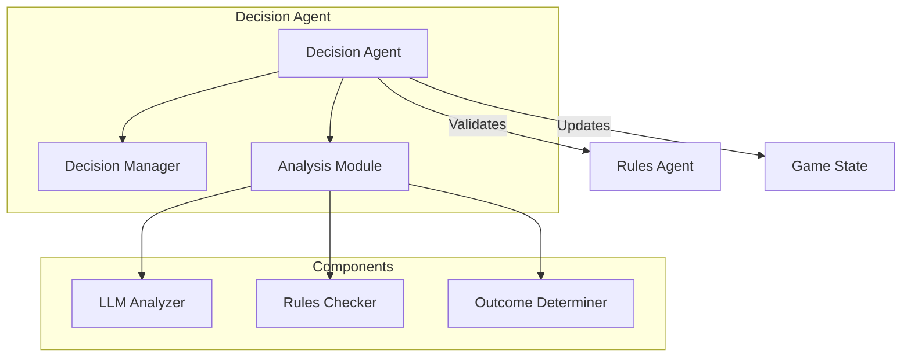
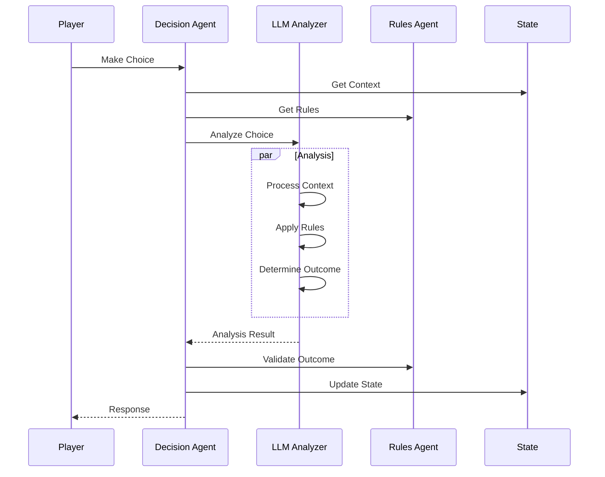

# Decision Agent

!!! abstract "Overview"
    The Decision Agent is responsible for processing and analyzing player choices, determining outcomes, and managing the game's decision-making logic using LLM-based analysis.

## Core Architecture



## Key Components

### Decision Processing

=== "Features"
    * **Input Analysis**
        * Player choice analysis
        * Context evaluation
        * Rule validation
    
    * **Outcome Determination**
        * Next section selection
        * Condition evaluation
        * State updates
    
    * **LLM Integration**
        * Semantic understanding
        * Context awareness
        * Response analysis

=== "Implementation"
    ```python
    class DecisionAgent:
        async def analyze_response(
            self,
            section_number: int,
            user_response: str,
            rules: Dict
        ) -> AnalysisResult:
            messages = [
                SystemMessage(content=self.system_prompt),
                HumanMessage(content=f"""
                    Section: {section_number}
                    Response: {user_response}
                    Rules: {json.dumps(rules, indent=2)}
                """)
            ]
            
            # LLM Analysis
            response = await self.llm.ainvoke(messages)
            
            # Parse and validate
            result = json.loads(response.content)
            return AnalysisResult(
                next_section=result["next_section"],
                conditions=result.get("conditions", []),
                analysis=result.get("analysis", "")
            )
    ```

### Analysis System

The Decision Agent analyzes through multiple stages:

1. **Input Processing**
   - Player choice parsing
   - Context extraction
   - Rule gathering

2. **Decision Logic**
   - LLM-based analysis
   - Rule validation
   - Outcome determination

3. **Result Generation**
   - Next section selection
   - Condition evaluation
   - State update preparation

## Decision Flow



## Best Practices

1. **Analysis Design**
   - Clear context building
   - Comprehensive rule checking
   - Robust error handling

2. **LLM Integration**
   - Structured prompts
   - Response validation
   - Error recovery

3. **Performance**
   - Response caching
   - Parallel validation
   - State optimization

## Error Handling

The Decision Agent implements robust error handling:

```python
try:
    # Analyze decision
    result = await self._analyze_decision(context)
    
    # Validate with rules
    if await self.rules_agent.validate(result):
        return result
    raise DecisionError("Invalid decision outcome")
    
except DecisionError as e:
    logger.error("Decision error: {}", str(e))
    return DecisionResult(
        valid=False,
        error=str(e),
        fallback_section=context.current_section
    )
```

## Performance Considerations

1. **LLM Optimization**
   - Prompt engineering
   - Response caching
   - Batch processing

2. **Validation Strategy**
   - Early validation
   - Rule prioritization
   - Cache management

3. **State Management**
   - Efficient updates
   - Change tracking
   - Memory optimization

## Integration Points

1. **Rules Agent**
   - Rule validation
   - Constraint checking
   - Mechanics enforcement

2. **State Manager**
   - Context retrieval
   - State updates
   - History tracking

3. **Story Graph**
   - Flow control
   - Section transitions
   - Event processing
