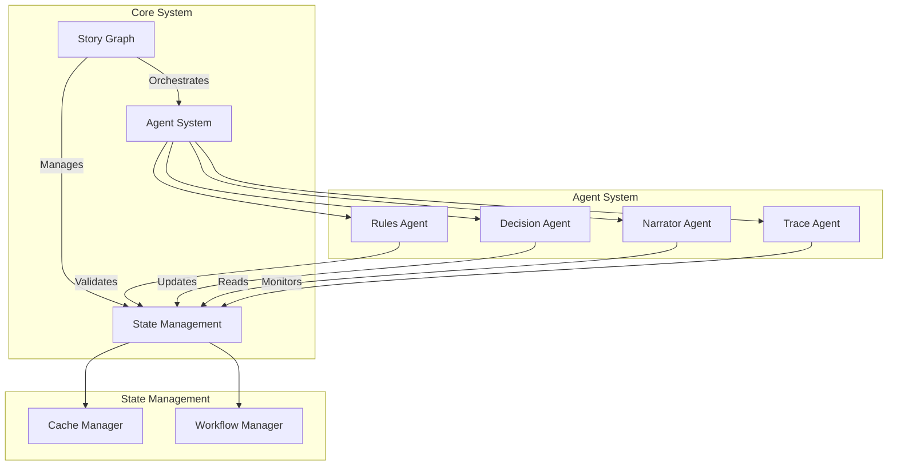
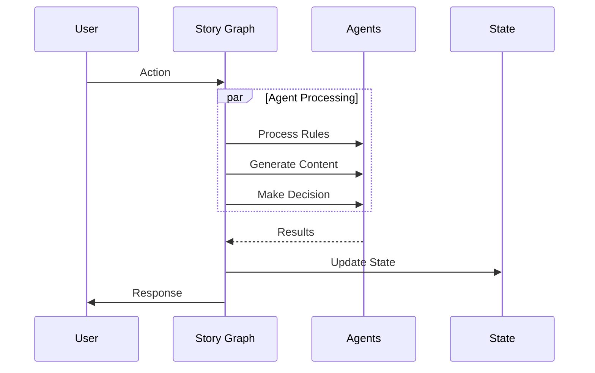

# Agent System Architecture

!!! abstract "Overview"
    CASYS RPG implements a sophisticated multi-agent architecture that combines LLM-based processing with symbolic reasoning. The system uses a neurosymbolic approach where each agent specializes in specific cognitive functions while working together through a central Story Graph.

## System Architecture



## Core Components

### [Story Graph](story-graph.md)

!!! info "Central Orchestrator"
    The Story Graph acts as the central nervous system, coordinating all agents and managing the game's workflow.

* **Key Features**
    * Workflow orchestration
    * Parallel processing
    * State management
    * Error handling

### [Rules Agent](rules.md)

!!! info "Rule Engine"
    The Rules Agent validates game mechanics and ensures consistency of actions.

* **Key Features**
    * Rule validation
    * Constraint checking
    * Game mechanics
    * State validation

### [Decision Agent](decision.md)

!!! info "Decision Processor"
    The Decision Agent analyzes player choices and determines outcomes using LLM-based processing.

* **Key Features**
    * Choice analysis
    * Outcome determination
    * LLM integration
    * Rule compliance

### [Narrator Agent](narrator.md)

!!! info "Content Generator"
    The Narrator Agent manages content generation and presentation.

* **Key Features**
    * Content generation
    * Text formatting
    * Style management
    * Narrative consistency

### [Trace Agent](trace.md)

!!! info "System Monitor"
    The Trace Agent handles logging, monitoring, and analytics.

* **Key Features**
    * Event logging
    * Analytics
    * Monitoring
    * Debugging

## Communication Flow



## Implementation Details

### Protocol-Based Design

The system uses protocols for agent interfaces:

```python
class AgentProtocol(Protocol):
    """Base protocol for all agents."""
    
    async def initialize(self) -> None:
        """Initialize agent resources."""
        ...
    
    async def process(self, context: Context) -> Result:
        """Process agent-specific logic."""
        ...
```

### State Management

State is managed immutably:

```python
class GameState(BaseModel):
    """Immutable game state."""
    
    section: int
    context: Dict[str, Any]
    history: List[Event]
    metadata: Dict[str, Any]
```

## Best Practices

1. **Agent Design**
   - Single Responsibility Principle
   - Protocol-based interfaces
   - Immutable state
   - Error boundaries

2. **Communication**
   - Async processing
   - Type safety
   - Error handling
   - State validation

3. **Performance**
   - Parallel execution
   - State caching
   - Resource management
   - Memory efficiency

## Neurosymbolic Integration

The system combines:

1. **Neural Components**
   - LLM-based processing
   - Pattern recognition
   - Natural language understanding
   - Content generation

2. **Symbolic Components**
   - Rule systems
   - State machines
   - Logic validation
   - Structured data

This hybrid approach provides:

* Rich reasoning capabilities
* Natural language interaction
* Rule-based consistency
* Structured workflow

## Workflow Generation

The system supports automatic workflow generation:

1. **Input Processing**
   - Story scripts
   - Game rules
   - Content templates

2. **Graph Generation**
   - Node creation
   - Edge definition
   - State mapping

3. **Agent Integration**
   - Role assignment
   - Protocol binding
   - State management
