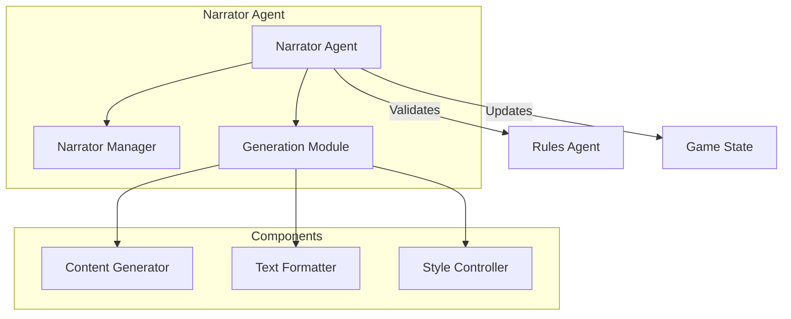
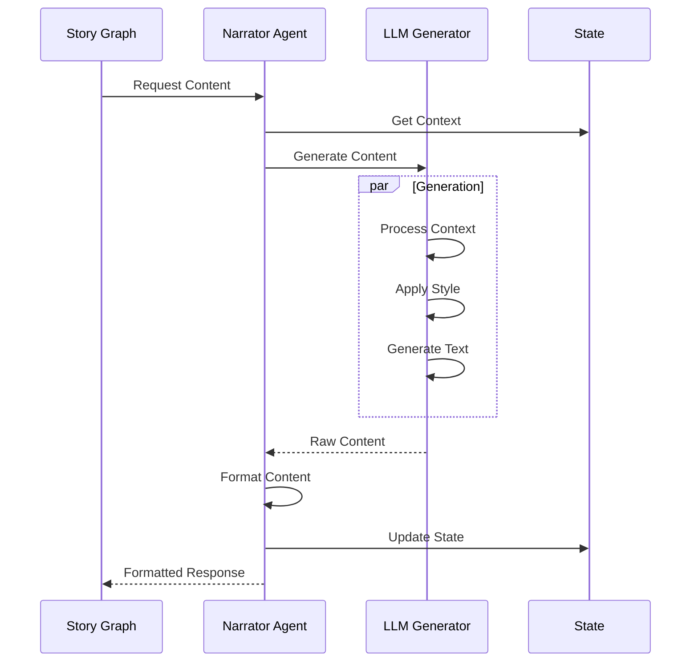

# Narrator Agent

!!! abstract "Overview"
    The Narrator Agent is responsible for generating and managing game content, formatting responses, and maintaining narrative consistency using LLM-based generation.

## Core Architecture



## Key Components

### Content Generation

=== "Features"
    * **Narrative Generation**
        * Scene description
        * Character dialogue
        * Action narration
    
    * **Content Adaptation**
        * Context awareness
        * Style consistency
        * Tone management
    
    * **LLM Integration**
        * Prompt engineering
        * Response formatting
        * Style control

=== "Implementation"
    ```python
    class NarratorAgent:
        async def generate_content(
            self,
            context: NarrativeContext,
            style: NarrativeStyle
        ) -> NarrativeContent:
            # Build prompt with context and style
            prompt = self._build_narrative_prompt(context, style)
            
            # Generate content using LLM
            response = await self.llm.ainvoke(prompt)
            
            # Format and structure the response
            return await self._format_narrative(response, style)
    ```

### Formatting System

The Narrator Agent formats content through multiple stages:

1. **Content Structure**
   - Scene organization
   - Dialogue formatting
   - Description layout

2. **Style Application**
   - Tone consistency
   - Language adaptation
   - Theme maintenance

3. **Output Formatting**
   - Markdown formatting
   - HTML generation
   - Text styling

## Narrative Flow



## Best Practices

1. **Content Generation**
   - Clear context building
   - Style consistency
   - Error recovery

2. **LLM Integration**
   - Structured prompts
   - Response validation
   - Style control

3. **Performance**
   - Content caching
   - Batch processing
   - Memory management

## Error Handling

The Narrator Agent implements comprehensive error handling:

```python
try:
    # Generate content
    content = await self._generate_content(context)
    
    # Format and validate
    if await self._validate_content(content):
        return await self._format_content(content)
    raise NarratorError("Invalid content generated")
    
except NarratorError as e:
    logger.error("Narration error: {}", str(e))
    return NarrativeContent(
        valid=False,
        error=str(e),
        fallback_content=self._get_fallback_content()
    )
```

## Performance Considerations

1. **Generation Optimization**
   - Prompt caching
   - Response memoization
   - Batch processing

2. **Formatting Strategy**
   - Template system
   - Style sheets
   - Content reuse

3. **State Management**
   - Context caching
   - Style persistence
   - Memory efficiency

## Integration Points

1. **Story Graph**
   - Flow control
   - Content requests
   - State updates

2. **Rules Agent**
   - Content validation
   - Context checking
   - Style enforcement

3. **State Manager**
   - Context retrieval
   - History tracking
   - Style management

## Style System

The Narrator manages different narrative styles:

```python
class NarrativeStyle:
    def __init__(self):
        self.tone: str  # e.g., "dramatic", "humorous"
        self.language: str  # e.g., "formal", "casual"
        self.perspective: str  # e.g., "first_person", "third_person"
        self.formatting: Dict[str, str]  # Style-specific formatting
```

## Content Templates

The agent uses templates for consistent formatting:

```python
TEMPLATES = {
    "scene": """
    # {scene_title}
    
    {scene_description}
    
    ## Available Actions
    {actions}
    """,
    
    "dialogue": """
    **{speaker}**: {dialogue}
    """,
    
    "action": """
    > {action_description}
    """
}
```
