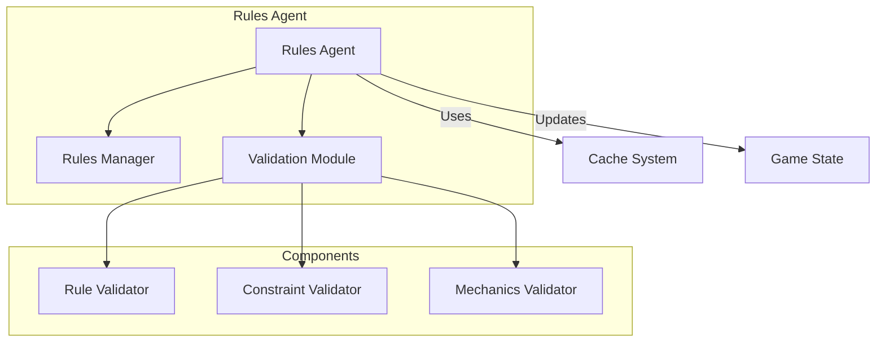
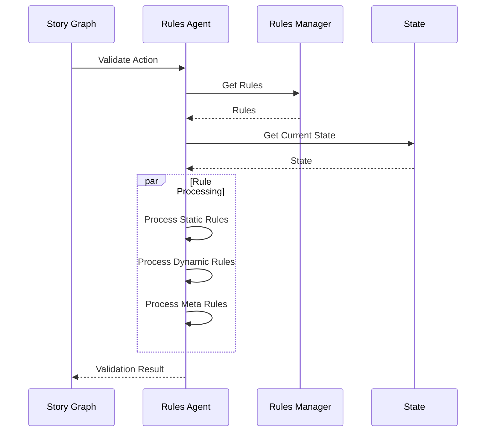

# Rules Agent

!!! abstract "Overview"
    The Rules Agent is responsible for validating game rules, managing constraints, and ensuring game mechanics are properly enforced.

## Core Architecture



## Key Components

### Rules Management

=== "Features"
    * **Rule Processing**
        * Rule interpretation
        * Context validation
        * Condition checking
    
    * **Constraint System**
        * Game mechanics
        * Player limitations
        * World rules
    
    * **Validation Logic**
        * Action validation
        * State consistency
        * Rule dependencies

=== "Implementation"
    ```python
    class RulesAgent:
        async def validate(self, action: Action, state: GameState) -> bool:
            # Check basic constraints
            if not await self._validate_basic_constraints(action, state):
                return False
                
            # Validate game mechanics
            if not await self._validate_mechanics(action, state):
                return False
                
            # Check complex rules
            return await self._validate_complex_rules(action, state)
    ```

### Validation System

The Rules Agent validates through multiple layers:

1. **Basic Constraints**
   - Action validity
   - Player permissions
   - Resource availability

2. **Game Mechanics**
   - Combat rules
   - Skill checks
   - Resource management

3. **Complex Rules**
   - Quest conditions
   - Story progression
   - World state

## Rule Processing

=== "Rule Types"
    * **Static Rules**
        * Core game mechanics
        * Basic constraints
        * Invariant conditions
    
    * **Dynamic Rules**
        * Context-dependent
        * State-based
        * Temporal rules
    
    * **Meta Rules**
        * Rule interactions
        * Rule priorities
        * Rule conflicts

=== "Implementation"
    ```python
    class RulesAgent:
        async def process_rules(self, context: RuleContext) -> RuleResult:
            # Process static rules
            static_result = await self._process_static_rules(context)
            if not static_result.valid:
                return static_result
                
            # Process dynamic rules
            dynamic_result = await self._process_dynamic_rules(context)
            if not dynamic_result.valid:
                return dynamic_result
                
            # Process meta rules
            return await self._process_meta_rules(context)
    ```

## Validation Flow



## Best Practices

1. **Rule Design**
   - Keep rules atomic
   - Define clear hierarchies
   - Document dependencies
   - Handle conflicts

2. **Validation**
   - Validate early
   - Fail fast
   - Provide clear errors
   - Cache results

3. **Performance**
   - Optimize hot paths
   - Cache rule results
   - Batch validations
   - Profile regularly

## Error Handling

The Rules Agent implements comprehensive error handling:

```python
try:
    # Validate rules
    result = await self._validate_rules(context)
    return result
except RulesError as e:
    # Handle rule-specific errors
    logger.error("Rule validation error: {}", str(e))
    return RuleResult(valid=False, error=str(e))
except Exception as e:
    # Handle unexpected errors
    logger.error("Unexpected error in rules: {}", str(e))
    return RuleResult(valid=False, error="Internal rules error")
```

## Performance Considerations

1. **Caching Strategy**
   - Rule results caching
   - State caching
   - Cache invalidation

2. **Optimization**
   - Rule prioritization
   - Early termination
   - Parallel validation

3. **Resource Management**
   - Memory efficiency
   - CPU utilization
   - Cache size control
