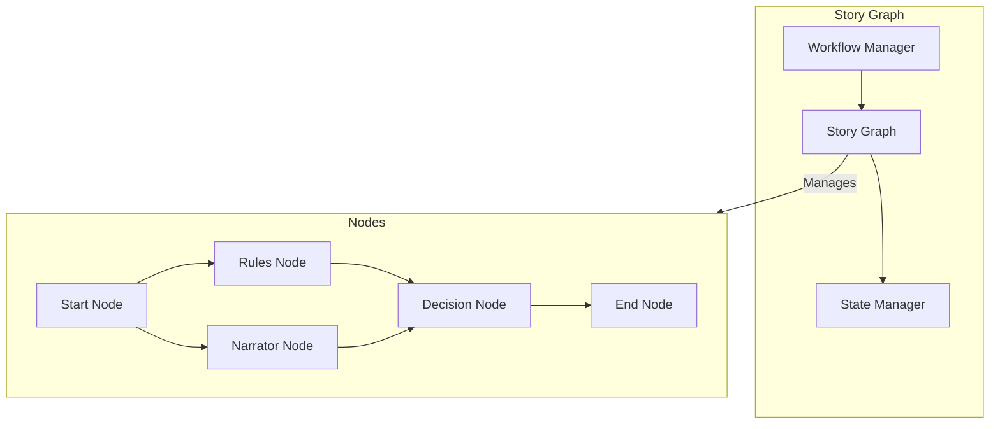
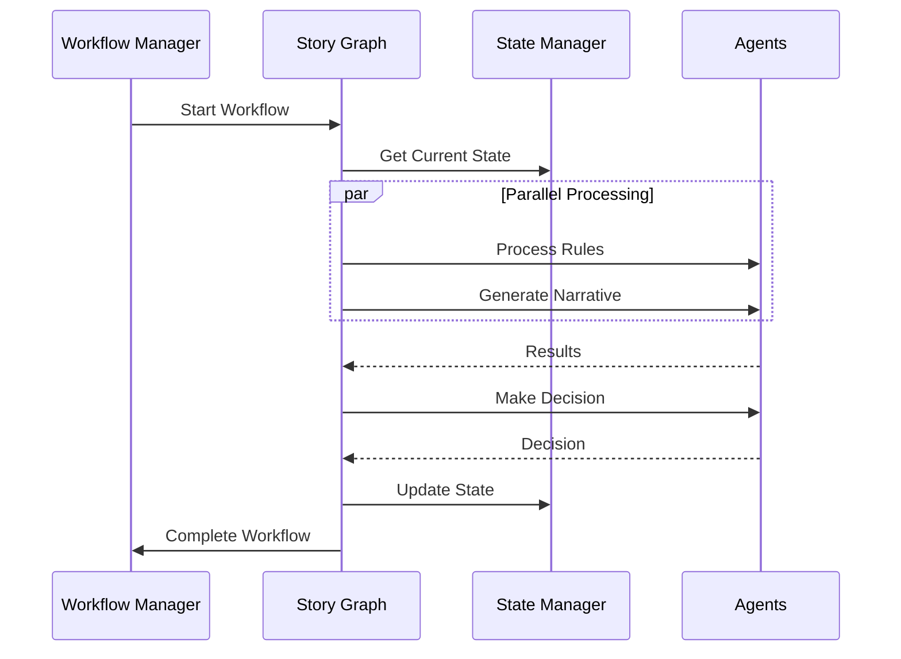

# Story Graph Agent

!!! abstract "Overview"
    The Story Graph Agent is the central orchestrator of CASYS RPG, managing workflow and coordinating all other agents using LangGraph.

## Core Architecture



## Key Components

### Workflow Management

=== "Features"
    * **Node System**
        * Start/End nodes
        * Agent-specific nodes
        * Parallel processing
    
    * **State Transitions**
        * Section management
        * State validation
        * Error handling
    
    * **Flow Control**
        * Fan-out operations
        * Fan-in aggregation
        * Conditional branching

=== "Implementation"
    ```python
    class StoryGraph:
        async def _setup_workflow(self) -> None:
            self._graph = StateGraph(GameState)
            
            # Add nodes
            self._graph.add_node("node_start", self.workflow_manager.start_workflow)
            self._graph.add_node("node_rules", self._process_rules)
            self._graph.add_node("node_narrator", self._process_narrative)
            self._graph.add_node("node_decision", self._process_decision)
            self._graph.add_node("node_end", self.workflow_manager.end_workflow)
            
            # Add edges
            self._graph.add_edge(START, "node_start")
            self._graph.add_edge("node_start", ["node_rules", "node_narrator"])
            self._graph.add_edge(["node_rules", "node_narrator"], "node_decision")
    ```

### State Management

The Story Graph manages game state through:

1. **State Validation**
   - Input validation
   - State consistency checks
   - Error detection

2. **State Transitions**
   - Section progression
   - State updates
   - History tracking

3. **Checkpoint System**
   - State persistence
   - Recovery points
   - Rollback capability

## Agent Coordination

The Story Graph coordinates other agents through:

=== "Coordination Patterns"
    * **Parallel Processing**
        * Rules and Narrator agents run in parallel
        * Results aggregated for Decision agent
        * Trace agent logs all operations
    
    * **State Sharing**
        * Immutable state objects
        * Validated transitions
        * Cached results
    
    * **Error Handling**
        * Agent-specific errors
        * Graceful degradation
        * Recovery strategies

=== "Implementation"
    ```python
    class StoryGraph:
        async def process_event(self, event: GameEvent) -> GameState:
            # Initialize workflow if needed
            if not self._graph:
                await self._setup_workflow()
                
            try:
                # Process event through workflow
                result = await self._graph.process({
                    "event": event,
                    "state": await self.state_manager.get_current_state()
                })
                
                return result
                
            except Exception as e:
                return await self.workflow_manager.handle_error(e)
    ```

## Communication Flow



## Best Practices

1. **Graph Design**
   - Keep nodes focused and simple
   - Use parallel processing when possible
   - Implement proper error boundaries
   - Monitor node performance

2. **State Management**
   - Validate all state changes
   - Use immutable state objects
   - Implement checkpoints
   - Handle edge cases

3. **Agent Coordination**
   - Define clear protocols
   - Use type hints
   - Handle timeouts
   - Log interactions

## Error Handling

The Story Graph implements robust error handling:

```python
try:
    # Process workflow
    result = await self._graph.process(input_data)
    return result
except GameError as e:
    # Handle game-specific errors
    return await self.workflow_manager.handle_error(e)
except Exception as e:
    # Handle unexpected errors
    logger.error("Unexpected error in workflow: {}", str(e))
    return await self.workflow_manager.handle_error(e)
```

## Performance Considerations

1. **Parallelization**
   - Parallel agent execution
   - Async/await patterns
   - Resource pooling

2. **Caching**
   - State caching
   - Result memoization
   - Hot path optimization

3. **Memory Management**
   - State cleanup
   - Resource release
   - Memory monitoring
