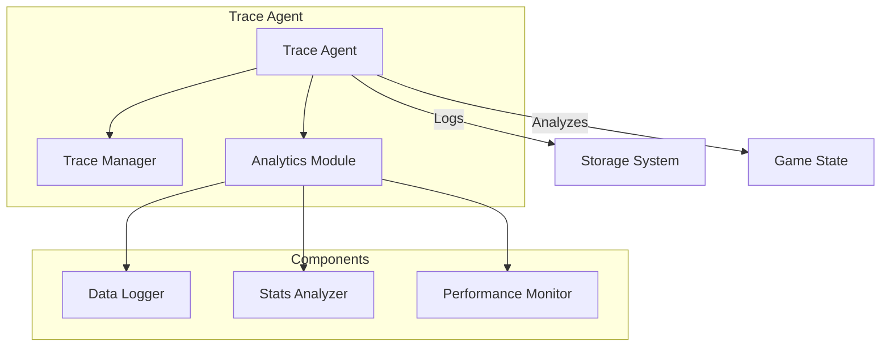
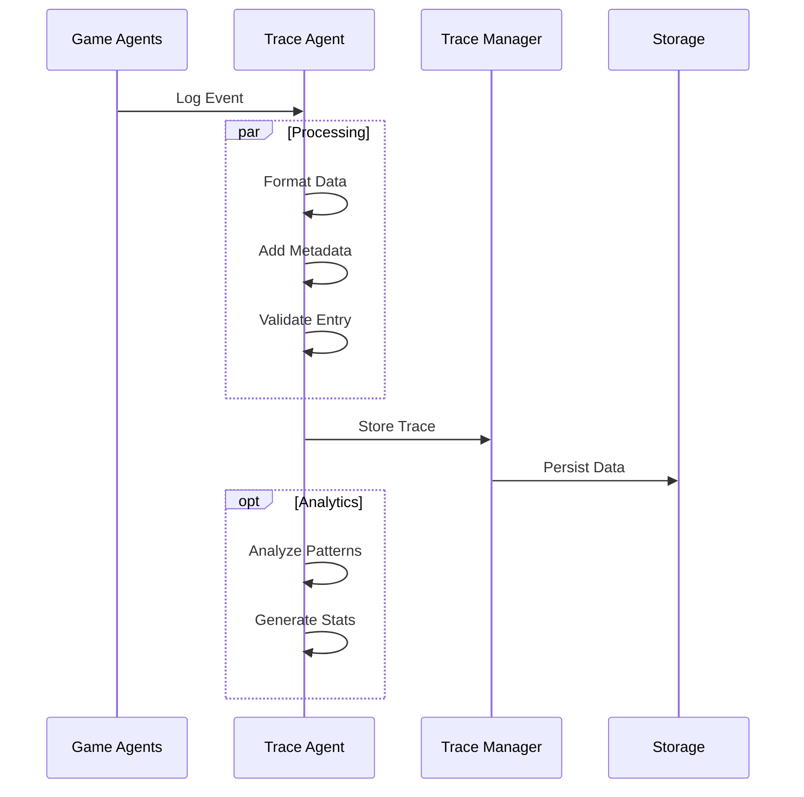

# Trace Agent

!!! abstract "Overview"
    The Trace Agent is responsible for logging, monitoring, and analyzing the game's state changes, player actions, and system events. It provides essential debugging information and analytics capabilities.

## Core Architecture



## Key Components

### Trace System

=== "Features"
    * **Event Logging**
        * State changes
        * Player actions
        * System events
    
    * **Analytics**
        * Performance metrics
        * Player statistics
        * System health
    
    * **Monitoring**
        * Real-time tracking
        * Error detection
        * Resource usage

=== "Implementation"
    ```python
    class TraceAgent:
        async def log_event(
            self,
            event_type: str,
            data: Dict[str, Any],
            metadata: Optional[Dict] = None
        ) -> None:
            timestamp = datetime.utcnow().isoformat()
            
            trace_entry = TraceEntry(
                timestamp=timestamp,
                event_type=event_type,
                data=data,
                metadata=metadata or {}
            )
            
            await self.trace_manager.store_trace(trace_entry)
    ```

### Analytics System

The Trace Agent processes data through multiple stages:

1. **Data Collection**
   - Event capture
   - State snapshots
   - Performance metrics

2. **Analysis**
   - Pattern detection
   - Trend analysis
   - Anomaly detection

3. **Reporting**
   - Stats generation
   - Alert triggering
   - Log aggregation

## Trace Flow



## Best Practices

1. **Logging Strategy**
   - Structured logging
   - Context preservation
   - Performance impact

2. **Data Management**
   - Efficient storage
   - Data rotation
   - Privacy compliance

3. **Analysis**
   - Real-time processing
   - Pattern detection
   - Resource efficiency

## Error Handling

The Trace Agent implements robust error handling:

```python
try:
    # Log trace entry
    await self._log_entry(entry)
    
    # Process analytics if needed
    if entry.requires_analysis:
        await self._process_analytics(entry)
        
except TraceError as e:
    logger.error("Trace error: {}", str(e))
    # Use fallback logging
    await self._fallback_log(entry, error=str(e))
except Exception as e:
    logger.error("Unexpected error in trace: {}", str(e))
    # Ensure critical data is not lost
    await self._emergency_log(entry)
```

## Performance Considerations

1. **Logging Optimization**
   - Batch processing
   - Async logging
   - Buffer management

2. **Storage Strategy**
   - Data compression
   - Index optimization
   - Cleanup policies

3. **Resource Management**
   - Memory efficiency
   - I/O optimization
   - CPU utilization

## Integration Points

1. **Story Graph**
   - Workflow tracking
   - State transitions
   - Event logging

2. **State Manager**
   - State changes
   - History tracking
   - Checkpoint logging

3. **Other Agents**
   - Action logging
   - Decision tracking
   - Error reporting

## Analytics Features

The Trace Agent provides various analytics capabilities:

```python
class Analytics:
    async def analyze_patterns(self, timeframe: str) -> Dict[str, Any]:
        """Analyze patterns in traced data."""
        return await self._pattern_analysis(timeframe)
        
    async def generate_stats(self) -> Dict[str, Any]:
        """Generate statistical reports."""
        return await self._stats_generation()
        
    async def detect_anomalies(self) -> List[Anomaly]:
        """Detect anomalies in system behavior."""
        return await self._anomaly_detection()
```

## Monitoring System

The agent includes a comprehensive monitoring system:

```python
class Monitor:
    def __init__(self):
        self.metrics: Dict[str, Metric] = {}
        self.alerts: List[Alert] = []
        self.thresholds: Dict[str, float] = {}
        
    async def check_health(self) -> HealthStatus:
        """Check system health metrics."""
        return await self._health_check()
        
    async def trigger_alert(self, condition: str) -> None:
        """Trigger system alerts."""
        await self._alert_handling(condition)
```
