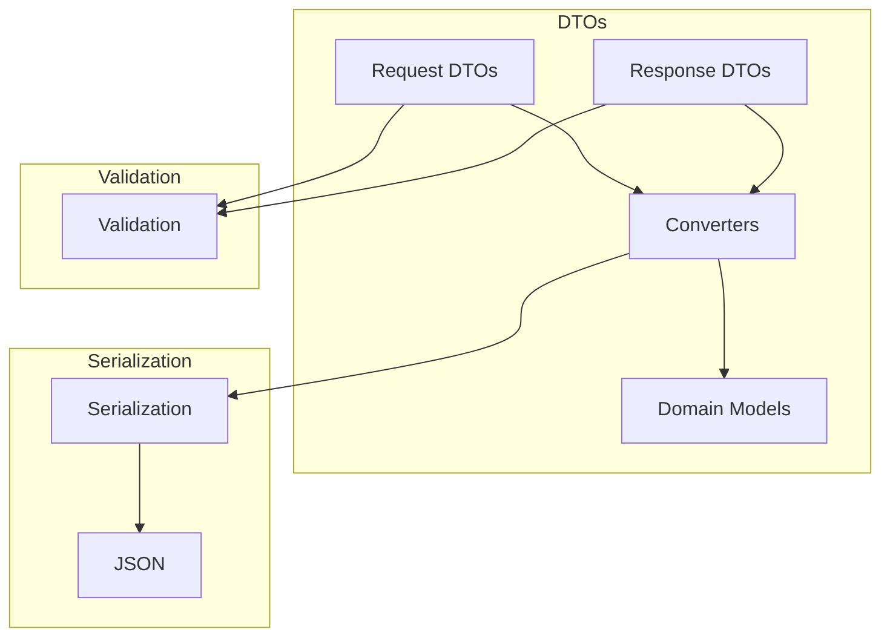

# Data Transfer Objects

!!! abstract "Overview"
    DTOs (Data Transfer Objects) in CASYS RPG handle the serialization and deserialization of data between the API layer and the domain models.

## DTO Architecture



## Request DTOs

### Game Initialization
```python
class GameInitRequest(BaseModel):
    """Game initialization request.
    
    Future extensions:
    - player_id: Player identification
    - settings: Game-specific parameters
    """
    player_id: Optional[str] = None
    settings: Optional[Dict[str, Any]] = None
```

### Player Actions
```python
class ActionRequest(BaseModel):
    """Player action request."""
    game_id: str
    action_type: str
    data: Dict[str, Any]

class ChoiceRequest(BaseModel):
    """Player choice request."""
    game_id: str
    choice_id: str
    choice_text: str
    metadata: Optional[Dict[str, Any]] = None

class ResponseRequest(BaseModel):
    """Player response request."""
    game_id: str
    response: str
    metadata: Optional[Dict[str, Any]] = None
```

### Feedback
```python
class FeedbackRequest(BaseModel):
    """User feedback request."""
    game_id: str
    feedback_type: str
    content: str
    metadata: Optional[Dict[str, Any]] = None
```

## Response DTOs

### Game State
```python
class GameResponse(BaseModel):
    """Game response with state."""
    success: bool = True
    message: Optional[str] = None
    game_id: Optional[str] = None
    state: Dict[str, Any]
```

### Action Results
```python
class ActionResponse(BaseModel):
    """Response to a game action."""
    success: bool = True
    message: Optional[str] = None
    action_result: Optional[Dict[str, Any]] = None
    state: Optional[Dict[str, Any]] = None
    error: Optional[str] = None
```

### System Status
```python
class HealthResponse(BaseModel):
    """Health check response model."""
    status: str
    message: str
    timestamp: str
    version: Optional[str] = None
    type: Optional[str] = None
```

## Converters

### State Conversion
```python
def to_game_state(data: Dict[str, Any]) -> GameState:
    """Convert API data to GameState model."""
    return GameState(**data)

def from_game_state(state: GameState) -> Dict[str, Any]:
    """Convert GameState model to API response data."""
    return state.model_dump(
        exclude_none=True,    # Exclude None fields
        by_alias=True,        # Use aliases for serialization
        exclude_unset=True    # Exclude unset fields
    )
```

### Feedback Conversion
```python
def to_domain_feedback(
    request: FeedbackRequest
) -> DomainFeedbackRequest:
    """Convert FeedbackRequest DTO to domain model."""
    return DomainFeedbackRequest(
        content=request.content,
        feedback_type=request.feedback_type,
        session_id=request.game_id,
        metadata=request.metadata or {}
    )
```

## Integration Examples

### With Routes
```python
@game_router_rest.post("/initialize")
async def initialize_game(
    init_request: GameInitRequest,
    agent_mgr: AgentManager = Depends(get_agent_manager)
) -> GameResponse:
    """Initialize game with DTO."""
    game_state = await agent_mgr.initialize_game()
    state_dict = from_game_state(game_state)
    return GameResponse(
        success=True,
        game_id=state_dict["game_id"],
        state=state_dict
    )
```

### With WebSocket
```python
async def handle_ws_message(
    message: Dict[str, Any],
    websocket: WebSocket
) -> None:
    """Handle WebSocket message with DTOs."""
    if message["type"] == "choice":
        choice = ChoiceRequest(**message)
        response = await process_choice(choice)
        await websocket.send_json(
            ActionResponse(
                success=True,
                action_result=response
            ).model_dump()
        )
```

## Best Practices

1. **DTO Design**
    * Clear separation from domain models
    * Proper validation
    * Minimal dependencies
    * Clear documentation

2. **Conversion**
    * Type safety
    * Proper serialization
    * Error handling
    * Performance optimization

3. **Validation**
    * Input validation
    * Type checking
    * Error messages
    * Security checks

4. **Integration**
    * Clean interfaces
    * Error handling
    * Performance
    * Maintainability
