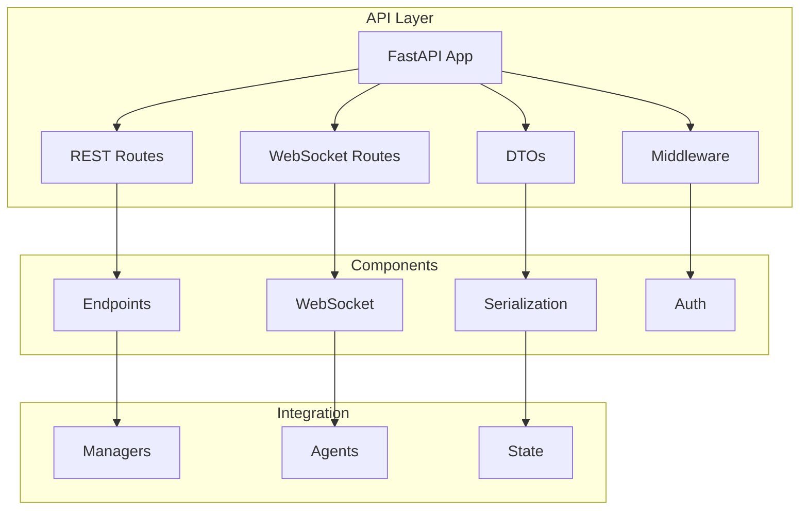

# API Architecture

!!! abstract "Overview"
    CASYS RPG exposes its functionality through a FastAPI-based REST and WebSocket API. The API is designed to be robust, performant, and developer-friendly.

## Architecture Overview



## Core Components

### FastAPI Application
```python
app = FastAPI(
    title="CASYS RPG API",
    description="API pour le jeu de rôle CASYS",
    version="1.0.0",
    docs_url="/docs",
    redoc_url="/redoc",
    openapi_url="/openapi.json",
    lifespan=lifespan
)
```

### Configuration
```python
# Configuration
API_HOST = os.getenv("CASYS_HOST", "127.0.0.1")
API_PORT = int(os.getenv("CASYS_PORT", "8000"))
BASE_DIR = Path(os.path.dirname(os.path.abspath(__file__)))

# Storage configuration
def get_storage_config() -> StorageConfig:
    """Get storage configuration."""
    return StorageConfig.get_default_config(BASE_DIR / "data")
```

## API Structure

### REST Routes
* **Game Management**
    * State operations
    * Game flow control
    * Character management
    * Rules processing

* **Content Management**
    * Narrative content
    * Decision handling
    * Event tracking

### WebSocket Routes
* **Real-time Updates**
    * State synchronization
    * Event notifications
    * Interactive gameplay

* **Game Flow**
    * Story progression
    * Decision making
    * Character updates

## Data Transfer Objects

### Request/Response Models
```python
from pydantic import BaseModel

class GameStateDTO(BaseModel):
    """Game state data transfer object."""
    id: UUID
    version: int
    character: CharacterModel
    narrative: NarratorModel
    rules: RulesModel
    decision: DecisionModel
    trace: TraceModel
```

## Error Handling

### Exception Management
```python
@app.exception_handler(Exception)
async def global_exception_handler(
    request: Request,
    exc: Exception
) -> JSONResponse:
    """Global exception handler."""
    
    if isinstance(exc, GameError):
        return JSONResponse(
            status_code=400,
            content={"error": str(exc)}
        )
    
    # Log unexpected errors
    logger.error(f"Unexpected error: {exc}")
    return JSONResponse(
        status_code=500,
        content={"error": "Internal server error"}
    )
```

## API Documentation

### OpenAPI Schema
```python
def custom_openapi():
    """Custom OpenAPI schema configuration."""
    if app.openapi_schema:
        return app.openapi_schema
        
    openapi_schema = get_openapi(
        title="CASYS RPG API",
        version="1.0.0",
        description="API pour le jeu de rôle CASYS",
        routes=app.routes
    )
    
    app.openapi_schema = openapi_schema
    return app.openapi_schema
```

## Middleware

### CORS Configuration
```python
app.add_middleware(
    CORSMiddleware,
    allow_origins=["*"],
    allow_credentials=True,
    allow_methods=["*"],
    allow_headers=["*"]
)
```

## Integration Points

### With Managers
```python
from managers.dependencies import get_agent_manager

async def process_game_action(
    action: GameAction,
    manager: AgentManagerProtocol = Depends(get_agent_manager)
) -> GameState:
    """Process a game action using the agent manager."""
    return await manager.process_action(action)
```

### With WebSocket
```python
@app.websocket("/ws/game/{game_id}")
async def game_websocket(
    websocket: WebSocket,
    game_id: str,
    manager: AgentManagerProtocol = Depends(get_agent_manager)
):
    """WebSocket endpoint for game updates."""
    await websocket.accept()
    try:
        while True:
            data = await websocket.receive_json()
            response = await manager.process_ws_message(data)
            await websocket.send_json(response)
    except WebSocketDisconnect:
        logger.info(f"WebSocket disconnected: {game_id}")
```

## Best Practices

1. **API Design**
    * Clear endpoints
    * Proper validation
    * Consistent responses
    * Error handling

2. **Performance**
    * Efficient routing
    * Proper caching
    * Async operations
    * Resource management

3. **Security**
    * Input validation
    * Error handling
    * Rate limiting
    * Authentication

4. **Documentation**
    * Clear descriptions
    * Example responses
    * Error scenarios
    * Authentication details
