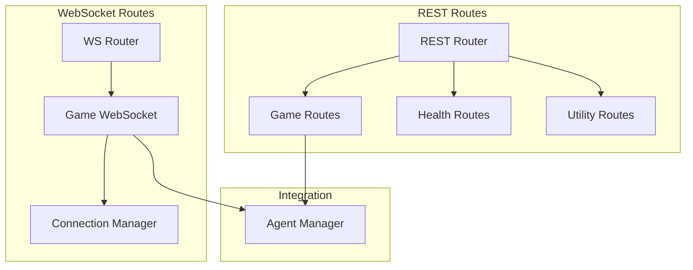

# API Routes

!!! abstract "Overview"
    CASYS RPG's API routes are divided into REST endpoints for standard operations and WebSocket endpoints for real-time updates.

## Route Architecture



## REST Routes

### Game Management

=== "Initialize Game"
    ```python
    @game_router_rest.post("/api/game/initialize")
    async def initialize_game(
        init_request: GameInitRequest,
        agent_mgr: AgentManager = Depends(get_agent_manager)
    ) -> GameResponse:
        """Initialize a new game session."""
        try:
            game_state = await agent_mgr.initialize_game()
            state_dict = from_game_state(game_state)
            return GameResponse(
                success=True,
                game_id=state_dict["game_id"],
                state=state_dict,
                message="Game initialized successfully"
            )
        except Exception as e:
            logger.error(f"Failed to initialize game: {e}")
            raise HTTPException(
                status_code=500,
                detail=str(e)
            )
    ```

=== "Get Game State"
    ```python
    @game_router_rest.get("/api/game/state/{game_id}")
    async def get_game_state(
        game_id: Optional[str] = None,
        agent_mgr: AgentManager = Depends(get_agent_manager)
    ) -> GameResponse:
        """Get current game state."""
        try:
            game_state = await agent_mgr.get_game_state(game_id)
            state_dict = from_game_state(game_state)
            return GameResponse(
                success=True,
                game_id=game_id,
                state=state_dict,
                message="Game state retrieved successfully"
            )
        except Exception as e:
            logger.error(f"Failed to get game state: {e}")
            raise HTTPException(
                status_code=404,
                detail=str(e)
            )
    ```

### Health Check

```python
@health_router_rest.get("/health")
async def health_check():
    """API health check endpoint."""
    return {
        "status": "healthy",
        "timestamp": datetime.utcnow()
    }
```

### Utility Routes

```python
@utils_router_rest.get("/utils/info")
async def get_api_info():
    """Get API information."""
    return {
        "version": "1.0.0",
        "endpoints": [
            "REST: /api/game/*",
            "WebSocket: /ws/game"
        ]
    }
```

## WebSocket Routes

### Connection Manager

```python
class GameWSConnectionManager:
    """Manages WebSocket connections."""
    
    def __init__(self):
        self.active_connections: list[WebSocket] = []

    async def connect(self, websocket: WebSocket):
        """Connect and initialize WebSocket."""
        try:
            await websocket.accept()
            self.active_connections.append(websocket)
            return True
        except Exception as e:
            logger.error(f"Connection error: {e}")
            return False

    async def broadcast(self, message: dict):
        """Broadcast to all connections."""
        for connection in self.active_connections:
            try:
                await connection.send_text(
                    json.dumps(message, default=_json_serial)
                )
            except Exception as e:
                logger.error(f"Broadcast error: {e}")
                await self.handle_error(connection)
```

### Game WebSocket

```python
@game_router_ws.websocket("/ws/game")
async def game_websocket_endpoint(
    websocket: WebSocket,
    agent_mgr: AgentManager = Depends(get_agent_manager)
):
    """WebSocket endpoint for game updates."""
    try:
        # Connect
        if not await ws_manager.connect(websocket):
            return
            
        # Main loop
        while True:
            try:
                # Receive message
                data = await websocket.receive_json()
                
                # Process message
                if data["type"] == "choice":
                    choice = ChoiceRequest(**data)
                    response = await agent_mgr.process_choice(choice)
                    
                # Broadcast update
                await ws_manager.broadcast({
                    "type": "update",
                    "data": response
                })
                    
            except WebSocketDisconnect:
                ws_manager.disconnect(websocket)
                break
                
    except Exception as e:
        logger.error(f"WebSocket error: {e}")
        await ws_manager.handle_error(websocket)
```

## Integration Points

### With Agent Manager

```python
class GameRoute:
    """Game route integration with AgentManager."""
    
    def __init__(self, agent_mgr: AgentManager):
        self.agent_mgr = agent_mgr
        
    async def process_action(self, action: dict) -> GameState:
        """Process game action."""
        return await self.agent_mgr.process_action(action)
        
    async def update_state(self, state: dict) -> None:
        """Update game state."""
        await self.agent_mgr.update_state(state)
```

### With WebSocket Manager

```python
class WSIntegration:
    """WebSocket integration with managers."""
    
    def __init__(
        self,
        ws_manager: GameWSConnectionManager,
        agent_mgr: AgentManager
    ):
        self.ws_manager = ws_manager
        self.agent_mgr = agent_mgr
        
    async def handle_update(self, update: dict):
        """Handle state update."""
        # Process update
        response = await self.agent_mgr.process_update(update)
        
        # Broadcast to clients
        await self.ws_manager.broadcast(response)
```

## Best Practices

1. **Route Design**
    * Clear endpoints
    * Proper validation
    * Error handling
    * Documentation

2. **WebSocket Management**
    * Connection handling
    * Error recovery
    * State synchronization
    * Performance optimization

3. **Integration**
    * Clean interfaces
    * Dependency injection
    * Error propagation
    * Resource management

4. **Security**
    * Input validation
    * Rate limiting
    * Authentication
    * Error handling
