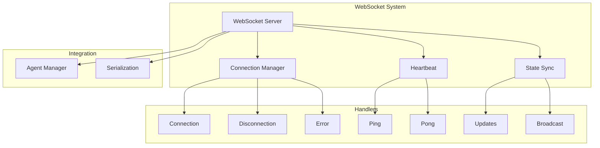

# WebSocket System

!!! abstract "Overview"
    CASYS RPG uses WebSockets for real-time bidirectional communication between the server and clients, enabling features like live game state updates and interactive gameplay.

## Architecture Overview



## Connection Management

### Connection Manager
```python
class GameWSConnectionManager:
    """Manages WebSocket connections."""
    
    def __init__(self):
        self.active_connections: list[WebSocket] = []

    async def connect(self, websocket: WebSocket):
        """Connect and initialize WebSocket."""
        try:
            await websocket.accept()
            self.active_connections.append(websocket)
            return True
        except Exception as e:
            logger.error(f"Connection error: {e}")
            return False

    def disconnect(self, websocket: WebSocket):
        """Handle client disconnection."""
        if websocket in self.active_connections:
            self.active_connections.remove(websocket)

    async def broadcast(self, message: dict):
        """Broadcast to all connections."""
        for connection in self.active_connections:
            try:
                await connection.send_text(
                    json.dumps(message, default=_json_serial)
                )
            except Exception as e:
                logger.error(f"Broadcast error: {e}")
                await self.handle_error(connection)
```

## Message Handling

### Main WebSocket Endpoint
```python
@game_router_ws.websocket("/ws/game")
async def game_websocket_endpoint(
    websocket: WebSocket,
    agent_mgr: AgentManager = Depends(get_agent_manager)
):
    """WebSocket endpoint for game updates."""
    # Connect
    if not await ws_manager.connect(websocket):
        return
        
    try:
        # Send initial state
        initial_state = await agent_mgr.get_state()
        if initial_state:
            state_dict = from_game_state(initial_state)
            await websocket.send_text(
                json.dumps(state_dict, default=_json_serial)
            )
            
        # Main message loop
        while True:
            data = await websocket.receive_json()
            await handle_message(data, websocket, agent_mgr)
            
    except WebSocketDisconnect:
        ws_manager.disconnect(websocket)
    except Exception as e:
        await ws_manager.handle_error(websocket)
```

### Message Types

=== "State Request"
    ```python
    if data.get("type") == "get_state":
        current_state = await agent_mgr.get_state()
        if current_state:
            state_dict = from_game_state(current_state)
            await websocket.send_text(
                json.dumps(state_dict, default=_json_serial)
            )
    ```

=== "Player Choice"
    ```python
    elif data.get("type") == "choice":
        choice_data = data.get("choice")
        choice_request = ChoiceRequest(
            game_id=choice_data.get("game_id", ""),
            choice_id=choice_data.get("choice_id", ""),
            choice_text=choice_data.get("choice_text", ""),
            metadata=choice_data.get("metadata", {})
        )
        
        new_state = await agent_mgr.process_game_state(
            user_input=choice_request.choice_text
        )
        
        if new_state:
            state_dict = from_game_state(new_state)
            await ws_manager.broadcast(state_dict)
    ```

=== "Heartbeat"
    ```python
    if data.get("type") == "ping":
        await websocket.send_json({
            "type": "pong",
            "timestamp": _json_serial(data.get("timestamp"))
        })
    ```

## Error Handling

### WebSocket Errors
```python
async def handle_error(self, websocket: WebSocket):
    """Handle WebSocket errors."""
    try:
        if websocket.client_state != WebSocketState.DISCONNECTED:
            await websocket.close(code=status.WS_1011_INTERNAL_ERROR)
    except Exception as e:
        logger.error(f"Error closing WebSocket: {e}")
    finally:
        self.disconnect(websocket)
```

### Message Errors
```python
try:
    # Process message
    await handle_message(data)
except Exception as e:
    logger.error(f"Message error: {e}")
    await websocket.send_json({
        "error": str(e),
        "status": "error",
        "type": "message_error"
    })
```

## State Synchronization

### Broadcast Updates
```python
async def broadcast_state_update(
    new_state: GameState,
    ws_manager: GameWSConnectionManager
):
    """Broadcast state update to all clients."""
    try:
        state_dict = from_game_state(new_state)
        await ws_manager.broadcast(state_dict)
    except Exception as e:
        logger.error(f"Broadcast error: {e}")
```

### State Validation
```python
async def validate_state_update(
    state: Dict[str, Any],
    agent_mgr: AgentManager
) -> bool:
    """Validate state update before broadcast."""
    try:
        return await agent_mgr.validate_state(state)
    except Exception as e:
        logger.error(f"Validation error: {e}")
        return False
```

## Best Practices

1. **Connection Management**
    * Proper initialization
    * Clean disconnection
    * Error recovery
    * Resource cleanup

2. **Message Handling**
    * Type validation
    * Error handling
    * Rate limiting
    * Timeout handling

3. **State Management**
    * Atomic updates
    * Validation
    * Synchronization
    * Conflict resolution

4. **Performance**
    * Efficient serialization
    * Connection pooling
    * Message batching
    * Resource optimization
