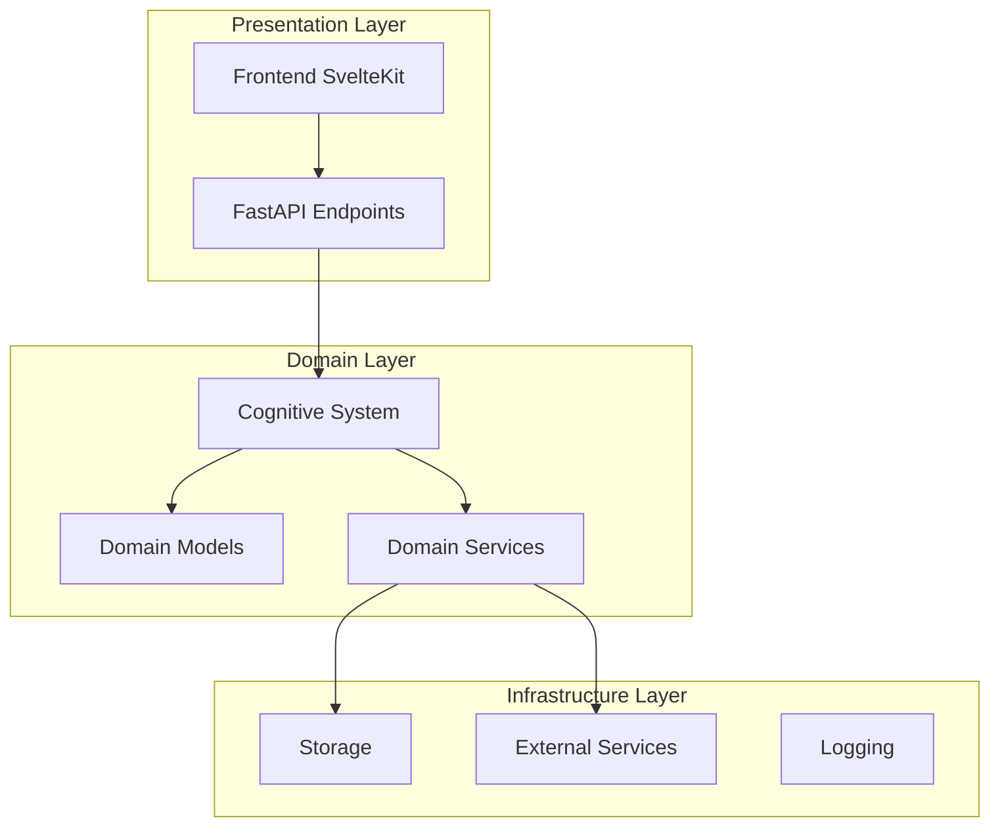
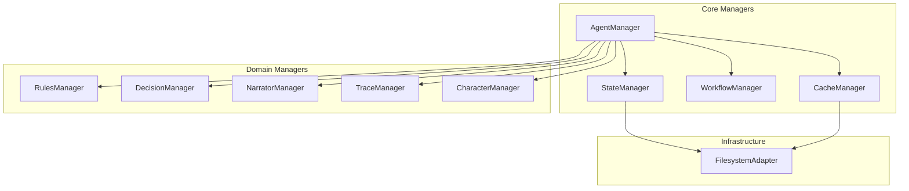
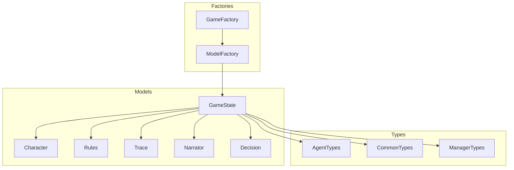
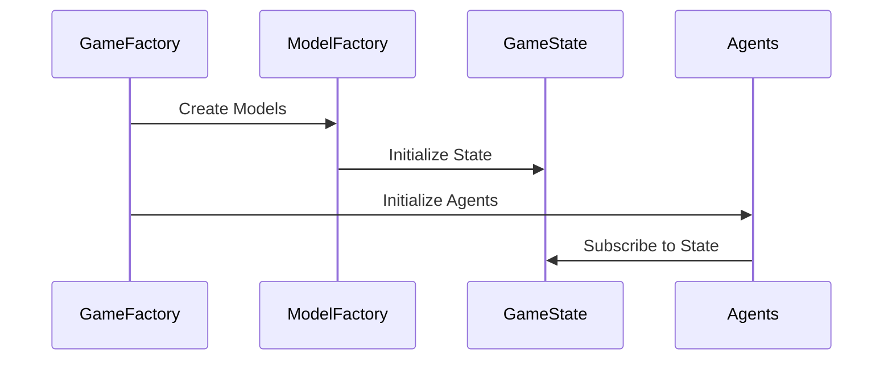
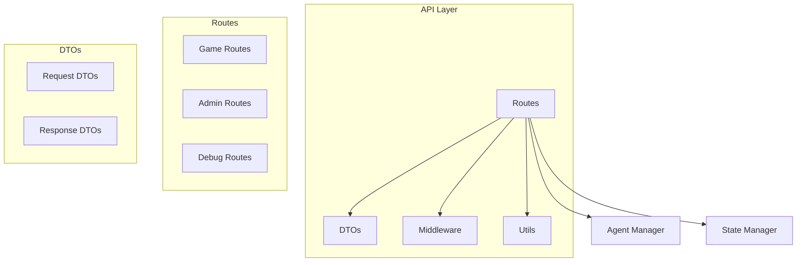

# System Architecture

!!! abstract "Overview"
    CASYS RPG follows a clean, layered architecture with clear separation of concerns and SOLID principles.

## Architecture Overview

!!! info "Key Components"
    The system is divided into three main layers:
    1. Presentation Layer (Frontend & API)
    2. Domain Layer (Cognitive System & Business Logic)
    3. Infrastructure Layer (Storage & External Services)



## Software Components

### Manager System



=== "Core Managers"
    * **Agent Manager**
        * Agent orchestration
        * Dependency injection
        * Event coordination
        * Error handling
    
    * **State Manager**
        * State lifecycle
        * Persistence
        * Version control
        * Event tracking
    
    * **Cache Manager**
        * Memory management
        * Cache invalidation
        * Performance optimization
    
    * **Workflow Manager**
        * Flow control
        * Transition management
        * Process coordination

=== "Domain Managers"
    * **Rules Manager**
        * Rule processing
        * Validation logic
        * Game mechanics
    
    * **Decision Manager**
        * Choice handling
        * Outcome processing
        * State transitions
    
    * **Narrator Manager**
        * Content generation
        * Response formatting
        * Style control
    
    * **Character Manager**
        * Character state
        * Attribute management
        * Inventory control
    
    * **Trace Manager**
        * Event logging
        * Analytics
        * Debugging

=== "Dependencies"
    * **Dependency Injection**
        * Protocol-based interfaces
        * Service registration
        * Lifecycle management
    
    * **Service Resolution**
        * Lazy loading
        * Scoped services
        * Singleton services

### Domain Models



=== "Game State"
    * **Core State Management**
        * Immutable state design
        * Version control
        * State transitions
        * Event tracking
    
    * **Key Components**
        * Character state
        * Game rules
        * Current section
        * History log
        * Metadata

=== "Data Models"
    * **Character Model**
        * Attributes
        * Inventory
        * Skills
        * Status
    
    * **Rules Model**
        * Game mechanics
        * Constraints
        * Validation rules
        * Action rules
    
    * **Decision Model**
        * Choice processing
        * Outcomes
        * Conditions
        * Analysis results

=== "Types System"
    * **Agent Types**
        * Agent protocols
        * Agent configurations
        * Agent states
    
    * **Manager Types**
        * Manager protocols
        * Configuration types
        * Service types
    
    * **Common Types**
        * Shared enums
        * Base types
        * Utility types

### Factory System



=== "Game Factory"
    * **Initialization**
        * Game configuration
        * State setup
        * Agent creation
        * Manager setup
    
    * **Dependencies**
        * Model injection
        * Service binding
        * Configuration loading
    
    * **Lifecycle**
        * Startup sequence
        * Shutdown handling
        * State persistence

=== "Model Factory"
    * **Model Creation**
        * State initialization
        * Model validation
        * Default values
        * Type checking
    
    * **Integration**
        * Factory patterns
        * Dependency injection
        * Configuration binding

### API Architecture



=== "API Structure"
    * **Routes**
        * Game endpoints
        * Admin endpoints
        * Debug endpoints
        * WebSocket handlers
    
    * **DTOs**
        * Request models
        * Response models
        * Validation
        * Serialization
    
    * **Middleware**
        * Authentication
        * Error handling
        * Logging
        * Rate limiting

=== "Integration"
    * **Manager Integration**
        * State management
        * Agent coordination
        * Cache control
    
    * **WebSocket**
        * Real-time updates
        * Event streaming
        * State synchronization
    
    * **Error Handling**
        * Global error handling
        * Response formatting
        * Status codes

## Cognitive System Architecture

!!! abstract "Overview"
    CASYS RPG uses a sophisticated multi-agent architecture that combines AI processing, 
    state management, and dynamic storytelling to create an immersive and adaptive gaming experience.

### System Components

=== "Core Architecture"
    * **Agent System**
        * Multi-agent orchestration
        * Event processing
        * State transitions
    
    * **State Management**
        * State validation
        * State transformation
        * History tracking
    
    * **Decision System**
        * Choice evaluation
        * Path selection
        * Outcome determination
    
    * **Memory Management**
        * Short-term memory
        * Long-term storage
        * Cache system

=== "Agents"
    * **Story Graph Agent**
        * Narrative flow control
        * Scene transitions
        * Story progression
    
    * **Rules Agent**
        * Rule validation
        * Constraint checking
        * Game mechanics
    
    * **Decision Agent**
        * Choice processing
        * Action validation
        * Outcome determination
    
    * **Narrator Agent**
        * Content generation
        * Text formatting
        * Response styling
    
    * **Trace Agent**
        * History tracking
        * State logging
        * Analytics collection

=== "State System"
    * **Game State**
        * Current scene
        * Player status
        * Game variables
    
    * **Memory System**
        * Short-term cache
        * Long-term storage
        * State history

## Design Principles

=== "Clean Architecture"
    !!! example "Layers"
        1. **Presentation**: UI & API endpoints
        2. **Domain**: Business logic & models
        3. **Infrastructure**: Storage & services

=== "SOLID Principles"
    !!! example "Implementation"
        - **S**ingle Responsibility: Each component has one job
        - **O**pen/Closed: Extend, don't modify
        - **L**iskov Substitution: Proper inheritance
        - **I**nterface Segregation: Specific interfaces
        - **D**ependency Inversion: Depend on abstractions

=== "Best Practices"
    !!! example "Guidelines"
        - Protocol-based design
        - Immutable state
        - Type safety
        - Error boundaries
        - Async processing
        - Resource management

## Core Principles

=== "Clean Architecture"
    !!! tip "Guidelines"
        - Clear dependency direction
        - Domain-driven design
        - Separation of concerns

=== "SOLID Principles"
    !!! example "Implementation"
        - **S**ingle Responsibility: Each component has one job
        - **O**pen/Closed: Extend, don't modify
        - **L**iskov Substitution: Proper inheritance
        - **I**nterface Segregation: Focused interfaces
        - **D**ependency Inversion: Depend on abstractions

=== "Design Patterns"
    !!! info "Patterns Used"
        - CQRS for state management
        - Repository pattern for data access
        - Factory pattern for object creation
        - Observer pattern for events

## Implementation Details

!!! example "Code Structure"
    ```python
    # Domain Layer
    class GameDomain:
        def __init__(self, repository: Repository):
            self.repository = repository
            self.cognitive_system = CognitiveSystem()
            
        async def process_action(self, action: Action) -> Result:
            # Implementation
            pass
    ```

## Layer Responsibilities

=== "Presentation Layer"
    - Handle user interactions
    - Format responses
    - Basic validation
    - Route requests

=== "Domain Layer"
    - Business logic
    - State management
    - Validation rules
    - Domain events

=== "Infrastructure Layer"
    - Data persistence
    - External services
    - Logging
    - Caching

## Best Practices

!!! tip "Architecture Guidelines"
    1. Keep layers loosely coupled
    2. Use dependency injection
    3. Follow domain-driven design
    4. Implement proper error handling

!!! warning "Common Pitfalls"
    - Mixing concerns between layers
    - Tight coupling to infrastructure
    - Inconsistent error handling
    - Direct database access from presentation

## Related Topics

- [Cognitive System](../cognitive-system/index.md)
- [Frontend Architecture](../frontend/architecture/index.md)
- [API Documentation](../api/index.md)

## Status and Roadmap

!!! note "Current Status"
    Version: 0.1.0
    - Core architecture implemented
    - Basic patterns in place
    - Testing framework ready

!!! abstract "Roadmap"
    1. Enhanced error handling
    2. Metrics collection
    3. Performance optimization
    4. Scalability improvements

---

!!! question "Questions?"
    Need help understanding the architecture? Check our 
    [GitHub Discussions](https://github.com/yourusername/casys-rpg/discussions) 
    or [raise an issue](https://github.com/yourusername/casys-rpg/issues).
