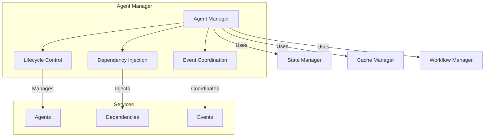
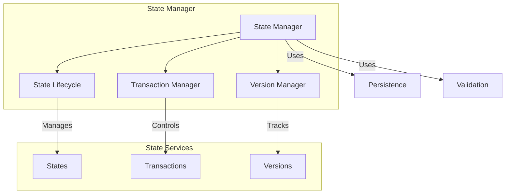
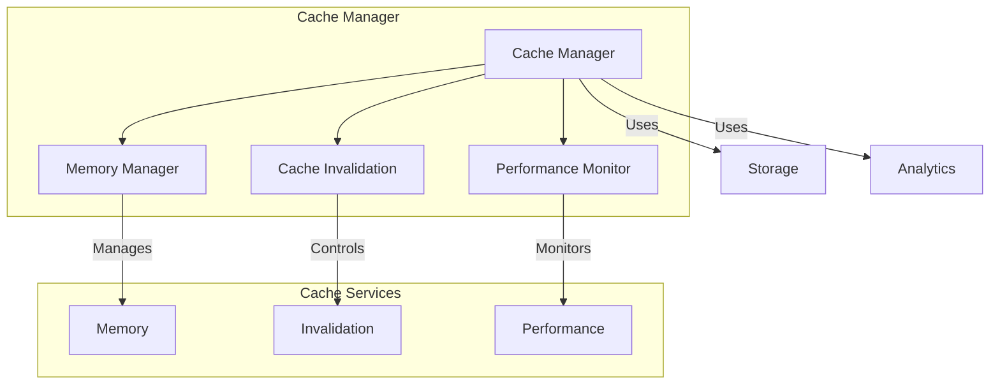
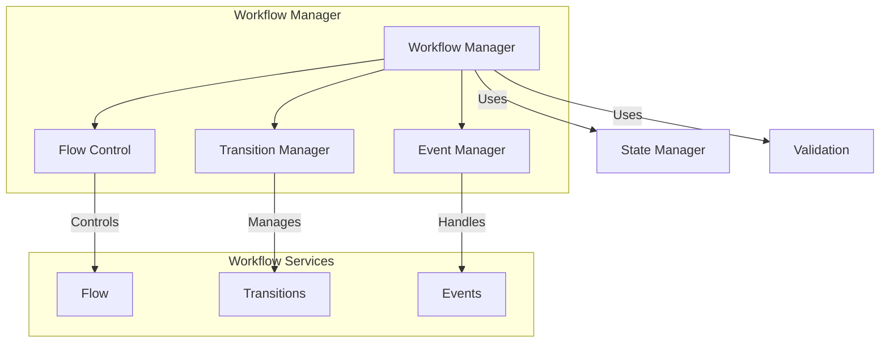

# Core Managers

!!! abstract "Overview"
    Core managers form the backbone of the system, providing essential services for state management, caching, workflow control, and agent coordination.

## Agent Manager



### Key Responsibilities

* **Agent Lifecycle**
    * Initialization
    * Resource allocation
    * Shutdown handling
    * Health monitoring

* **Dependency Management**
    * Service registration
    * Dependency resolution
    * Scope management
    * Circular dependency handling

* **Event System**
    * Event propagation
    * Error handling
    * State synchronization
    * Performance monitoring

## State Manager



### Key Features

* **State Lifecycle**
    * Creation
    * Updates
    * Validation
    * Cleanup

* **Transaction Management**
    * ACID properties
    * Rollback support
    * Conflict resolution
    * Consistency checks

* **Version Control**
    * State versioning
    * History tracking
    * Rollback capabilities
    * Audit trails

## Cache Manager



### Core Features

* **Memory Management**
    * Resource allocation
    * Memory monitoring
    * Cleanup strategies
    * Optimization

* **Cache Control**
    * Invalidation rules
    * Update strategies
    * Priority management
    * Size control

* **Performance**
    * Metrics collection
    * Optimization
    * Bottleneck detection
    * Resource planning

## Workflow Manager



### Key Components

* **Flow Control**
    * Process definition
    * Flow validation
    * State transitions
    * Error handling

* **Transition System**
    * State machine
    * Validation rules
    * Event handling
    * Recovery mechanisms

* **Event Management**
    * Event routing
    * Processing rules
    * Error recovery
    * Monitoring

## Integration Patterns

### Inter-Manager Communication

```python
class CoreManager:
    async def coordinate(self, event: Event) -> Result:
        # Validate with state manager
        if await self.state_manager.validate(event):
            # Update cache
            await self.cache_manager.update(event)
            
            # Process workflow
            result = await self.workflow_manager.process(event)
            
            # Update state
            await self.state_manager.update(result)
            
            return result
```

### Error Handling

```python
class CoreManager:
    async def handle_error(self, error: Exception) -> None:
        # Log error
        await self.trace_manager.log_error(error)
        
        # Cleanup resources
        await self.cleanup()
        
        # Notify other managers
        await self.notify_error(error)
        
        # Attempt recovery
        await self.recover()
```

## Best Practices

1. **Resource Management**
    * Proper initialization
    * Clean shutdown
    * Resource pooling
    * Memory optimization

2. **Error Handling**
    * Graceful degradation
    * Recovery strategies
    * Error boundaries
    * Logging and monitoring

3. **Performance**
    * Caching strategies
    * Resource optimization
    * Bottleneck prevention
    * Monitoring and profiling

4. **Integration**
    * Clear interfaces
    * Proper abstraction
    * Dependency management
    * Event coordination
