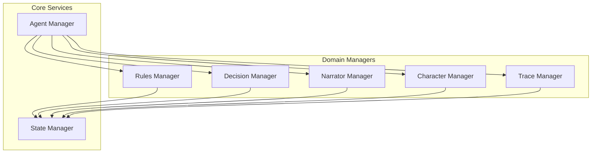
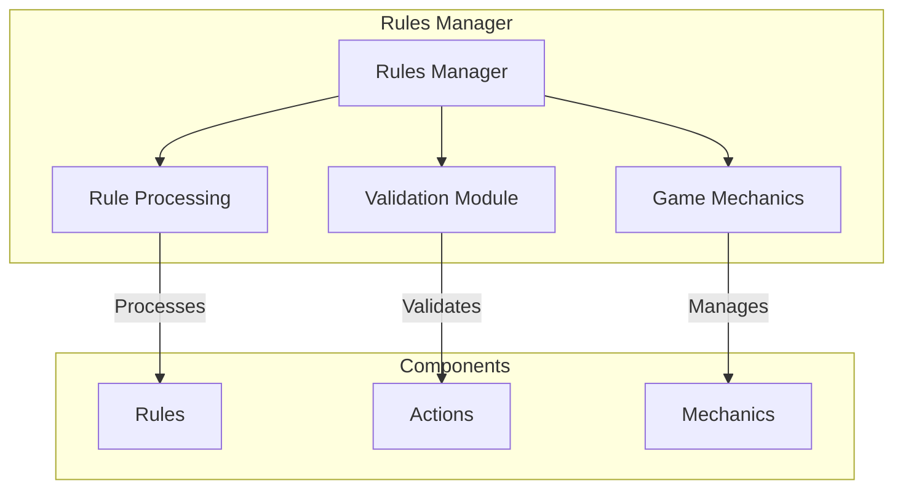
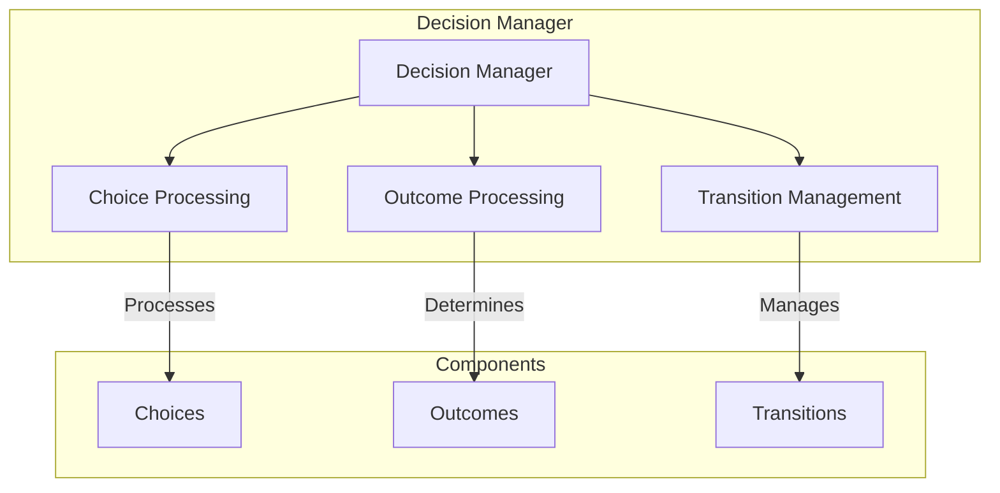
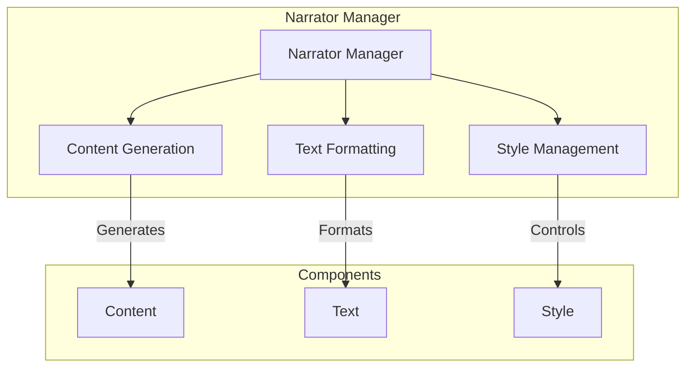
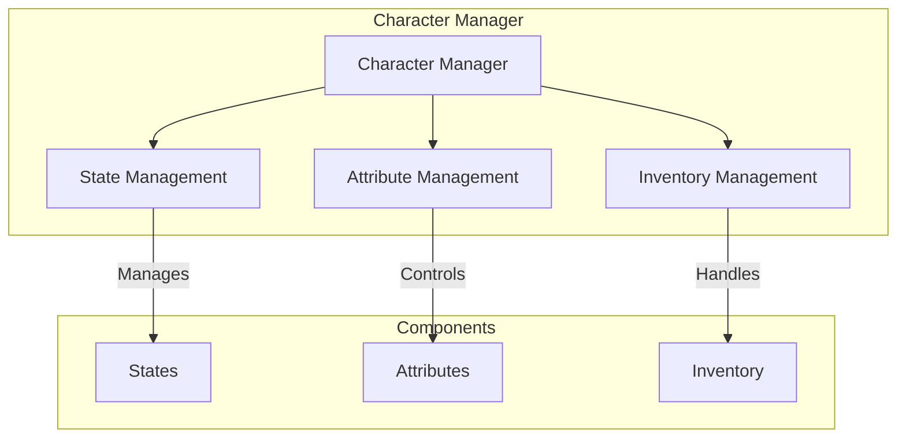
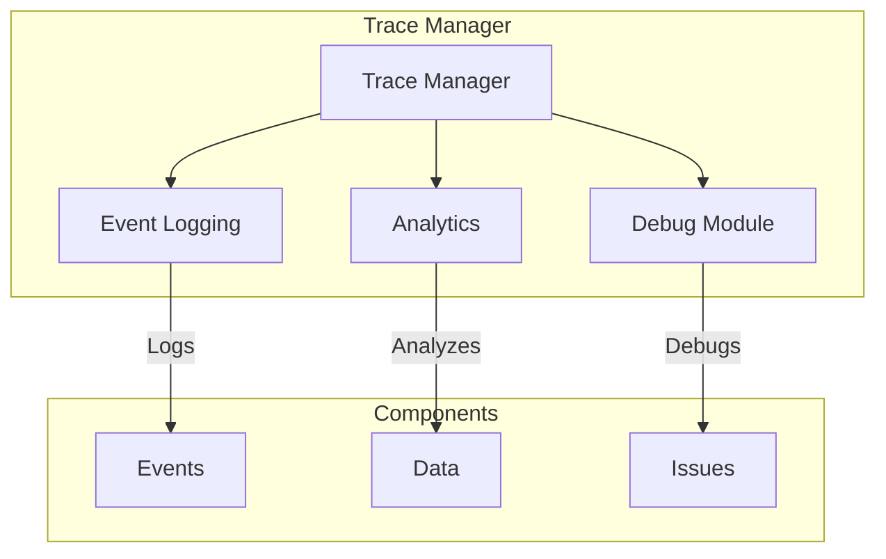

# Domain Managers

!!! abstract "Overview"
    Domain managers handle specific aspects of the game logic, each focusing on a particular domain such as rules, decisions, narration, characters, and tracing.

## Architecture Overview



## Rules Manager



### Key Features
* Rule interpretation and processing
* Action validation
* Game mechanics management
* Constraint checking
* State validation

## Decision Manager



### Key Features
* Choice validation and processing
* Outcome determination
* State transition management
* Decision history tracking
* Context analysis

## Narrator Manager



### Key Features
* Content generation and management
* Text formatting and styling
* Narrative flow control
* Response customization
* Context-aware content

## Character Manager



### Key Features
* Character state management
* Attribute tracking and updates
* Inventory control
* Status effects
* Character progression

## Trace Manager



### Key Features
* Event logging and tracking
* Analytics collection
* Debug information
* Performance monitoring
* History management

## Integration Patterns

### Manager Communication

```python
class DomainManager:
    async def process_event(self, event: Event) -> Result:
        # Validate with rules manager
        if await self.rules_manager.validate(event):
            # Process with specific logic
            result = await self._process(event)
            
            # Update character if needed
            await self.character_manager.update(result)
            
            # Log the event
            await self.trace_manager.log(event, result)
            
            return result
```

### State Updates

```python
class DomainManager:
    async def update_state(self, update: StateUpdate) -> None:
        # Validate update
        if await self.validate_update(update):
            # Apply update
            new_state = await self.state_manager.apply_update(update)
            
            # Notify other managers
            await self.notify_update(new_state)
            
            # Log update
            await self.trace_manager.log_update(update)
```

## Best Practices

1. **Domain Separation**
    * Clear boundaries
    * Single responsibility
    * Minimal dependencies
    * Clean interfaces

2. **State Management**
    * Atomic updates
    * Validation
    * History tracking
    * Error handling

3. **Integration**
    * Event-based communication
    * Loose coupling
    * Clear protocols
    * Error boundaries

4. **Performance**
    * Efficient processing
    * Resource management
    * Caching strategies
    * Monitoring
