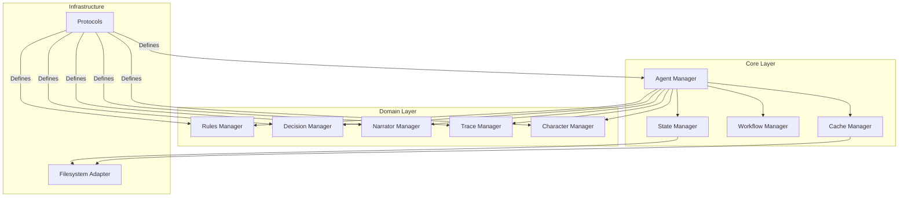

# Manager System Architecture

!!! abstract "Overview"
    The manager layer provides a robust infrastructure for handling game state, business logic, and system operations. It follows a hierarchical structure with core managers orchestrating domain-specific managers through a dependency injection system.

## Architecture Overview



## Core Components

### Agent Manager

The Agent Manager serves as the central coordinator for all game agents and their interactions:

* **Responsibilities**
    * Agent lifecycle management
    * Dependency injection
    * Event coordination
    * Error handling

* **Key Features**
    * Protocol-based agent registration
    * Asynchronous event processing
    * State synchronization
    * Resource management

### State Manager

Handles all aspects of game state management:

* **Responsibilities**
    * State lifecycle
    * Persistence
    * Version control
    * Event tracking

* **Key Features**
    * Immutable state updates
    * Transaction management
    * State validation
    * History tracking

### Cache Manager

Optimizes system performance through intelligent caching:

* **Responsibilities**
    * Memory management
    * Cache invalidation
    * Performance optimization
    * Resource allocation

* **Key Features**
    * Multi-level caching
    * Invalidation strategies
    * Memory monitoring
    * Cache analytics

### Workflow Manager

Controls game flow and process coordination:

* **Responsibilities**
    * Flow control
    * Transition management
    * Process coordination
    * State machine logic

* **Key Features**
    * Workflow definition
    * State transitions
    * Event handling
    * Error recovery

## Domain Managers

Each domain manager specializes in a specific aspect of the game:

=== "Rules Manager"
    * **Purpose**: Manages game rules and mechanics
    * **Features**:
        * Rule processing
        * Validation logic
        * Game mechanics
        * Constraint checking

=== "Decision Manager"
    * **Purpose**: Handles choice processing and outcomes
    * **Features**:
        * Choice handling
        * Outcome processing
        * State transitions
        * Decision validation

=== "Narrator Manager"
    * **Purpose**: Controls game content and presentation
    * **Features**:
        * Content generation
        * Response formatting
        * Style control
        * Narrative flow

=== "Character Manager"
    * **Purpose**: Manages character states and attributes
    * **Features**:
        * Character state
        * Attribute management
        * Inventory control
        * Status tracking

=== "Trace Manager"
    * **Purpose**: Handles logging and analytics
    * **Features**:
        * Event logging
        * Analytics
        * Debugging
        * Performance tracking

## Protocol System

The manager system uses a protocol-based architecture:

```python
class ManagerProtocol(Protocol):
    """Base protocol for all managers."""
    
    async def initialize(self) -> None:
        """Initialize manager resources."""
        ...
    
    async def shutdown(self) -> None:
        """Clean up manager resources."""
        ...
```

## Best Practices

1. **Dependency Management**
    * Use protocol-based interfaces
    * Implement proper lifecycle management
    * Handle circular dependencies
    * Maintain clear dependency graphs

2. **State Management**
    * Keep state immutable
    * Validate state transitions
    * Maintain audit trails
    * Handle edge cases

3. **Error Handling**
    * Implement proper error boundaries
    * Use typed exceptions
    * Provide detailed error context
    * Ensure proper cleanup

4. **Performance**
    * Optimize resource usage
    * Implement proper caching
    * Monitor memory consumption
    * Profile critical paths

## Integration Points

The manager system integrates with other components through:

1. **Agent System**
    * State updates
    * Event processing
    * Resource coordination

2. **API Layer**
    * Request handling
    * State management
    * Error propagation

3. **Storage Layer**
    * Data persistence
    * State recovery
    * Cache management
