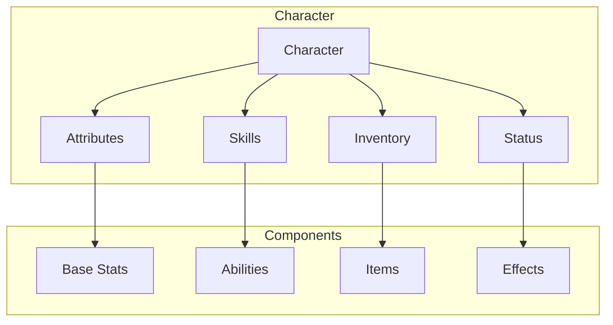
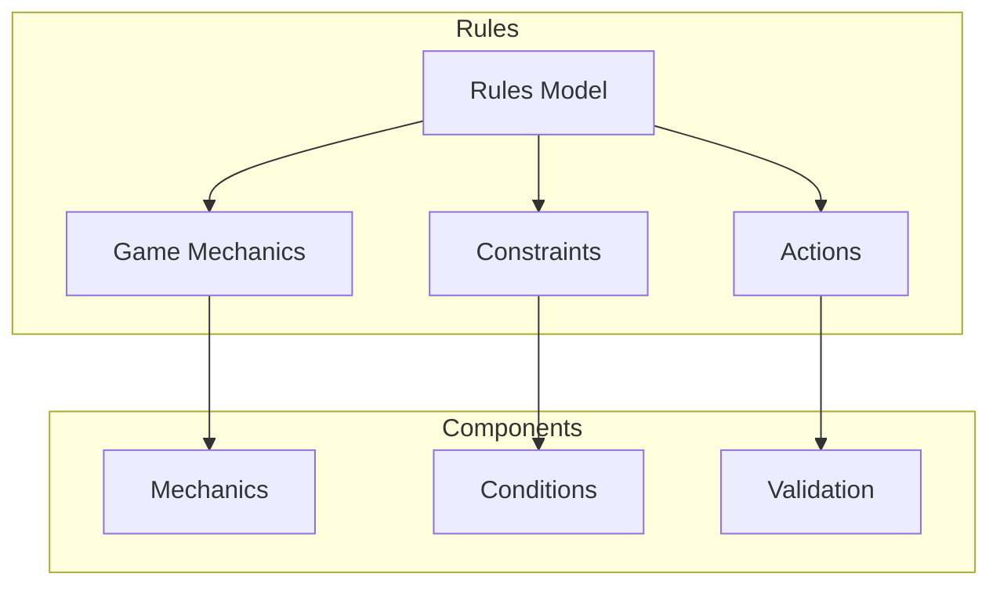
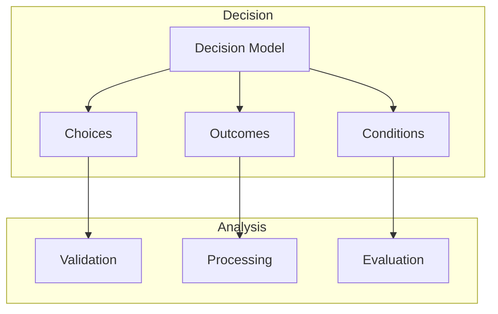
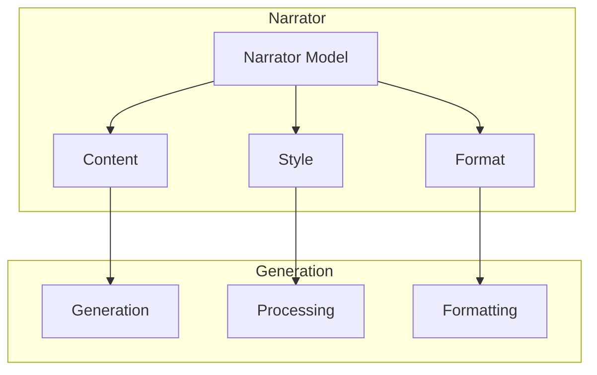
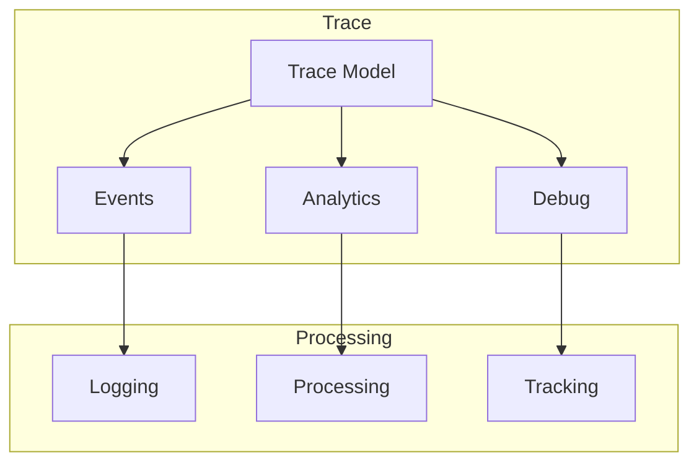

# Domain Models

!!! abstract "Overview"
    Domain models represent the core business objects in CASYS RPG. Each model is built using Pydantic v2 for robust validation and serialization.

## Character Model



### Structure
```python
class CharacterModel(BaseModel):
    """Character data model."""
    
    # Basic info
    id: UUID
    name: str
    level: int
    
    # Core attributes
    attributes: AttributeSet
    skills: SkillSet
    inventory: Inventory
    status: CharacterStatus
    
    # State
    current_health: int
    max_health: int
    experience: int
    
    class Config:
        validate_assignment = True
```

## Rules Model



### Structure
```python
class RulesModel(BaseModel):
    """Game rules model."""
    
    # Core rules
    mechanics: Dict[str, GameMechanic]
    constraints: List[Constraint]
    actions: Dict[str, ActionRule]
    
    # Validation
    conditions: List[Condition]
    validators: Dict[str, Validator]
    
    def validate_action(self, action: Action) -> bool:
        """Validate an action against rules."""
```

## Decision Model



### Structure
```python
class DecisionModel(BaseModel):
    """Decision processing model."""
    
    # Current decision
    choices: List[Choice]
    outcomes: Dict[str, Outcome]
    conditions: List[Condition]
    
    # Analysis
    context: DecisionContext
    history: List[Decision]
    
    async def analyze_choice(self, choice: str) -> AnalysisResult:
        """Analyze a player choice."""
```

## Narrator Model



### Structure
```python
class NarratorModel(BaseModel):
    """Narrative content model."""
    
    # Content
    current_scene: Scene
    dialog_history: List[Dialog]
    
    # Style
    style_settings: StyleConfig
    format_rules: FormatRules
    
    async def generate_content(self, context: Context) -> Content:
        """Generate narrative content."""
```

## Trace Model



### Structure
```python
class TraceModel(BaseModel):
    """System tracing model."""
    
    # Event tracking
    events: List[Event]
    analytics: AnalyticsData
    debug_info: DebugInfo
    
    # Processing
    processors: Dict[str, EventProcessor]
    filters: List[EventFilter]
    
    async def log_event(self, event: Event) -> None:
        """Log a system event."""
```

## Model Validation

### Base Validation
```python
class BaseGameModel(BaseModel):
    """Base class for all game models."""
    
    @validator("*")
    def validate_fields(cls, v):
        """Base validation for all fields."""
        return v
        
    class Config:
        validate_assignment = True
        extra = "forbid"
```

### Custom Validators
```python
class CustomValidators:
    """Custom validation functions."""
    
    @staticmethod
    def validate_health(value: int) -> int:
        """Validate health values."""
        if value < 0:
            raise ValueError("Health cannot be negative")
        return value
        
    @staticmethod
    def validate_inventory(items: List[Item]) -> List[Item]:
        """Validate inventory contents."""
        return items
```

## Model Integration

### Inter-Model Communication
```python
class ModelIntegration:
    """Handle model interactions."""
    
    async def update_models(
        self,
        character: CharacterModel,
        rules: RulesModel,
        action: Action
    ) -> Tuple[CharacterModel, RulesModel]:
        """Process model updates."""
        
        # Validate action
        if await rules.validate_action(action):
            # Update character
            new_character = await character.apply_action(action)
            
            # Update rules state
            new_rules = await rules.process_action(action)
            
            return new_character, new_rules
```

## Best Practices

1. **Model Design**
    * Clear responsibilities
    * Proper validation
    * Type safety
    * Error handling

2. **Validation**
    * Field-level validation
    * Cross-field validation
    * Custom validators
    * Error messages

3. **Integration**
    * Clean interfaces
    * State consistency
    * Error propagation
    * Event handling

4. **Performance**
    * Efficient validation
    * Optimized processing
    * Memory management
    * Caching strategy
