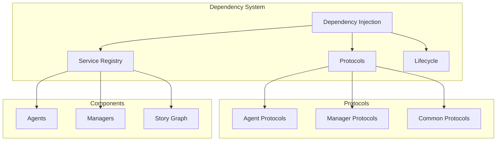
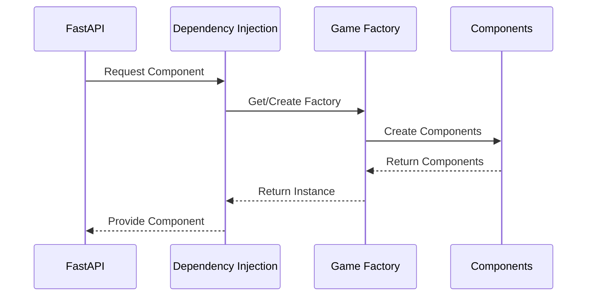

# Dependencies System

!!! abstract "Overview"
    The dependencies system in CASYS RPG manages component relationships and dependencies using protocols and dependency injection. It ensures loose coupling and maintainable code structure.

## Architecture Overview



## Protocol System

### Manager Protocols
```python
# Type alias for manager protocols
ManagerProtocols = Union[
    WorkflowManagerProtocol,
    StateManagerProtocol,
    CacheManagerProtocol,
    CharacterManagerProtocol,
    TraceManagerProtocol,
    RulesManagerProtocol,
    DecisionManagerProtocol,
    NarratorManagerProtocol
]
```

### Agent Protocols
```python
# Type alias for agent protocols
AgentProtocols = Union[
    NarratorAgentProtocol,
    RulesAgentProtocol,
    DecisionAgentProtocol,
    TraceAgentProtocol
]
```

## Component Management

### Game Components
```python
# Game components
_game_factory: Optional["GameFactory"] = None
_agent_manager: Optional[AgentManagerProtocol] = None
_game_components: Optional[tuple[
    Dict[str, AgentProtocols],
    Dict[str, ManagerProtocols]
]] = None
```

### Component Resolution
```python
def get_agent_manager() -> AgentManagerProtocol:
    """Get AgentManager instance.
    
    This function implements lazy loading and singleton pattern
    for the AgentManager and its dependencies.
    """
    global _agent_manager, _game_factory, _game_components
    
    if not _agent_manager:
        # Create new instance with dependencies
        if not _game_factory:
            _game_factory = GameFactory()
        
        if not _game_components:
            _game_components = _game_factory.create_game_components()
            
        agents, managers = _game_components
        
        _agent_manager = AgentManager(
            agents=agents,
            managers=managers,
            game_factory=_game_factory,
            story_graph_config=_game_factory._config.agent_configs.story_graph_config
        )
    
    return _agent_manager
```

## Protocol Definitions

### Base Protocols

=== "Agent Protocol"
    ```python
    class BaseAgentProtocol(Protocol):
        """Base protocol for all agents."""
        
        async def initialize(self) -> None: ...
        async def process(self, state: StateType) -> StateType: ...
        async def shutdown(self) -> None: ...
    ```

=== "Manager Protocol"
    ```python
    class ManagerProtocol(Protocol):
        """Base protocol for all managers."""
        
        async def initialize(self) -> None: ...
        async def process(self, context: Any) -> Any: ...
        async def shutdown(self) -> None: ...
    ```

### Specialized Protocols

=== "State Manager"
    ```python
    class StateManagerProtocol(Protocol):
        """Protocol for state management."""
        
        async def get_state(self) -> GameState: ...
        async def update_state(self, update: StateUpdate) -> None: ...
        async def validate_state(self, state: GameState) -> bool: ...
    ```

=== "Cache Manager"
    ```python
    class CacheManagerProtocol(Protocol):
        """Protocol for cache management."""
        
        async def get(self, key: str) -> Any: ...
        async def set(self, key: str, value: Any) -> None: ...
        async def invalidate(self, key: str) -> None: ...
    ```

## Dependency Flow



## Best Practices

1. **Protocol Design**
    * Clear interfaces
    * Single responsibility
    * Version compatibility
    * Error handling

2. **Dependency Management**
    * Lazy loading
    * Proper injection
    * Lifecycle handling
    * Resource cleanup

3. **Component Resolution**
    * Efficient resolution
    * Proper caching
    * Circular detection
    * Error management

4. **Integration**
    * Clean interfaces
    * Type safety
    * Resource management
    * Performance optimization

## Integration Examples

### With FastAPI
```python
from fastapi import Depends

async def get_agent_manager(
    manager: AgentManagerProtocol = Depends(get_agent_manager)
) -> AgentManagerProtocol:
    """Dependency injection for FastAPI."""
    return manager
```

### With Managers
```python
class GameManager:
    """Example of manager with dependencies."""
    
    def __init__(
        self,
        state_manager: StateManagerProtocol,
        cache_manager: CacheManagerProtocol
    ):
        self.state_manager = state_manager
        self.cache_manager = cache_manager
```

### With Agents
```python
class GameAgent:
    """Example of agent with dependencies."""
    
    def __init__(
        self,
        rules_manager: RulesManagerProtocol,
        decision_manager: DecisionManagerProtocol
    ):
        self.rules_manager = rules_manager
        self.decision_manager = decision_manager
```
