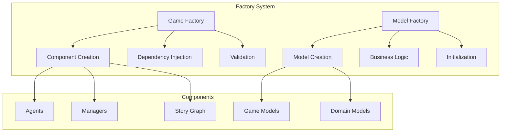
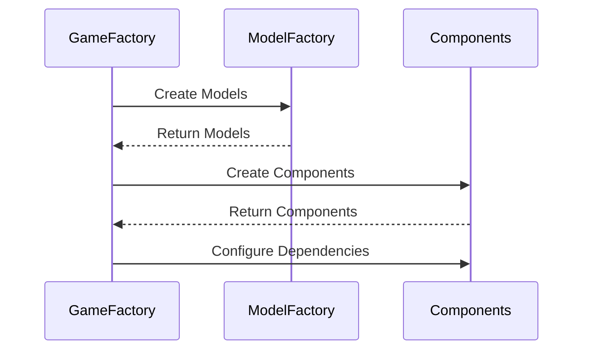
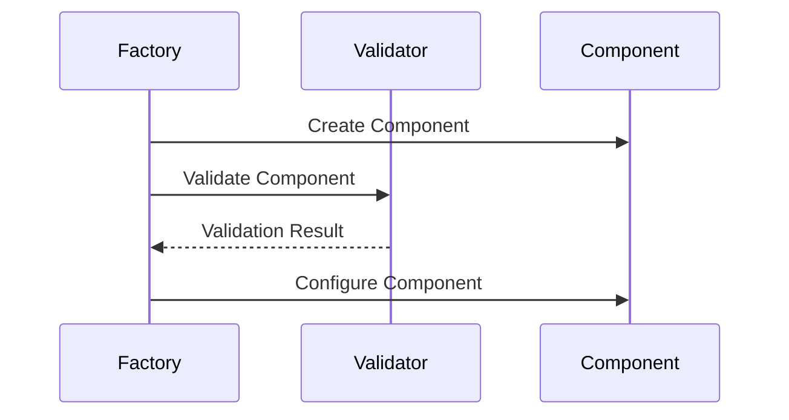

# Factory System

!!! abstract "Overview"
    The factory system in CASYS RPG is responsible for creating and configuring game components, models, and their dependencies. It uses two main factories: GameFactory and ModelFactory.

## Architecture Overview



## Game Factory

The GameFactory is responsible for creating and configuring all game components.

### Component Creation
```python
class GameFactory:
    """Factory for creating game components."""
    
    async def create_game_components(self) -> tuple[
        Dict[str, AgentProtocols],
        Dict[str, ManagerProtocols]
    ]:
        """Create all game components.
        
        Returns:
            tuple: (agents, managers)
            
        Raises:
            Exception: If component creation fails
        """
        try:
            # Create managers first
            managers = await self._create_managers()
            
            # Create agents with manager dependencies
            agents = await self._create_agents(managers)
            
            # Validate components
            self._validate_managers(managers)
            self._validate_agents(agents)
            
            return agents, managers
            
        except Exception as e:
            logger.error(f"Failed to create game components: {e}")
            raise
```

### Manager Creation
```python
# Type alias for manager protocols
ManagerProtocols = Union[
    WorkflowManagerProtocol,
    StateManagerProtocol,
    CacheManagerProtocol,
    CharacterManagerProtocol,
    TraceManagerProtocol,
    RulesManagerProtocol,
    DecisionManagerProtocol,
    NarratorManagerProtocol
]

async def _create_managers(self) -> Dict[str, ManagerProtocols]:
    """Create all game managers."""
    managers = {
        "state": StateManager(self._config),
        "cache": self._cache_manager,
        "character": CharacterManager(),
        "trace": TraceManager(),
        "rules": RulesManager(),
        "decision": DecisionManager(),
        "narrator": NarratorManager()
    }
    return managers
```

### Story Graph Creation
```python
async def create_story_graph(
    self,
    config: AgentConfigBase,
    managers: Dict[str, ManagerProtocols],
    agents: Dict[str, AgentProtocols]
) -> StoryGraphProtocol:
    """Create and configure story graph.
    
    Args:
        config: Configuration for story graph
        managers: Container with all managers
        agents: Container with all agents
        
    Returns:
        StoryGraphProtocol: Configured story graph
    """
```

## Model Factory

The ModelFactory handles the creation of game models with proper business logic validation.

### Game State Creation
```python
class ModelFactory:
    """Factory for creating business models."""
    
    @staticmethod
    def create_game_state(
        game_id: Optional[str] = None,
        session_id: Optional[str] = None,
        section_number: Optional[int] = None,
        narrative: Optional[NarratorModel] = None,
        rules: Optional[RulesModel] = None,
        decision: Optional[DecisionModel] = None,
        trace: Optional[TraceModel] = None,
        **kwargs: Dict[str, Any]
    ) -> GameState:
        """Create an empty GameState.
        
        This method creates a GameState with provided values or None.
        ID generation is handled by StateManager.
        """
```

### Model Initialization
```python
class ModelFactory:
    """Model initialization methods."""
    
    @staticmethod
    def create_character(
        name: str,
        stats: CharacterStats,
        **kwargs: Dict[str, Any]
    ) -> CharacterModel:
        """Create a character model with initial stats."""
        return CharacterModel(
            id=uuid.uuid4(),
            name=name,
            stats=stats,
            **kwargs
        )
```

## Factory Integration

### Component Dependencies


### Validation Flow


## Best Practices

1. **Component Creation**
    * Clear dependencies
    * Proper validation
    * Error handling
    * Resource management

2. **Model Creation**
    * Business logic validation
    * Default values
    * Type safety
    * Error handling

3. **Integration**
    * Clean interfaces
    * Dependency injection
    * Component lifecycle
    * Error propagation

4. **Performance**
    * Efficient creation
    * Resource pooling
    * Caching strategy
    * Memory management
