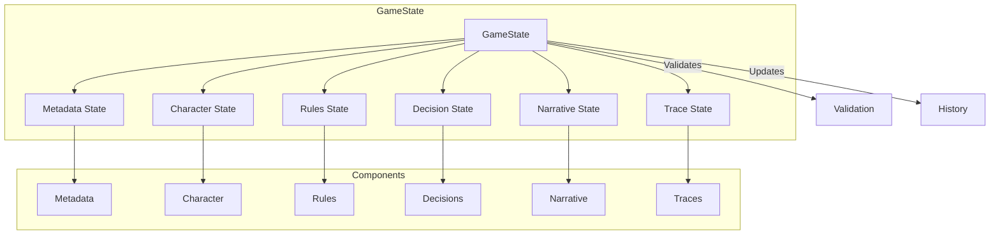

# Game State

!!! abstract "Overview"
    The Game State is the central data structure that maintains the entire game's state. It uses an immutable design pattern with Pydantic v2 for validation and serialization.

## Core Architecture



## State Structure

```python
class GameState(BaseModel):
    """Core game state model."""
    
    # Metadata
    id: UUID
    version: int
    timestamp: datetime
    
    # Game components
    character: CharacterModel
    rules: RulesModel
    decisions: DecisionModel
    narrative: NarratorModel
    trace: TraceModel
    
    # State management
    metadata: MetadataModel
    history: List[StateChange]
```

## State Components

### Character State
* **Attributes**
    * Base stats
    * Skills
    * Inventory
    * Status effects

* **Validation**
    * Attribute ranges
    * Skill requirements
    * Inventory limits
    * Status conflicts

### Rules State
* **Components**
    * Active rules
    * Constraints
    * Mechanics
    * Conditions

* **Validation**
    * Rule consistency
    * Constraint checking
    * Action validation
    * State transitions

### Decision State
* **Elements**
    * Current choices
    * Decision history
    * Outcomes
    * Conditions

* **Processing**
    * Choice validation
    * Outcome determination
    * State updates
    * History tracking

### Narrative State
* **Content**
    * Current scene
    * Dialog history
    * Story context
    * Style settings

* **Management**
    * Content generation
    * Context tracking
    * Style control
    * Flow management

### Trace State
* **Data**
    * Event log
    * State changes
    * Analytics
    * Debug info

* **Processing**
    * Event tracking
    * Analysis
    * Performance monitoring
    * Error logging

## State Management

### State Updates

```python
class StateManager:
    async def update_state(
        self,
        current_state: GameState,
        update: StateUpdate
    ) -> GameState:
        # Validate update
        if not await self._validate_update(update):
            raise StateValidationError("Invalid state update")
            
        # Create new state
        new_state = await self._create_new_state(
            current_state,
            update
        )
        
        # Add to history
        new_state.history.append(StateChange(
            timestamp=datetime.utcnow(),
            change_type=update.type,
            details=update.details
        ))
        
        return new_state
```

### State Validation

```python
class GameState(BaseModel):
    """Validation methods for game state."""
    
    @validator("character")
    def validate_character(cls, v):
        """Validate character state."""
        if not v.is_valid():
            raise ValueError("Invalid character state")
        return v
        
    @validator("rules")
    def validate_rules(cls, v):
        """Validate rules state."""
        if not v.check_consistency():
            raise ValueError("Inconsistent rules state")
        return v
```

## State History

The state maintains a complete history of changes:

```python
class StateChange(BaseModel):
    """Record of state changes."""
    
    timestamp: datetime
    change_type: StateChangeType
    details: Dict[str, Any]
    previous_state: Optional[UUID]
    metadata: Dict[str, Any]
```

## Best Practices

1. **Immutability**
    * Never modify state directly
    * Create new state for changes
    * Maintain change history
    * Use proper validation

2. **Validation**
    * Validate all updates
    * Check constraints
    * Maintain consistency
    * Handle edge cases

3. **Performance**
    * Optimize state size
    * Use efficient serialization
    * Cache when appropriate
    * Monitor memory usage

4. **Error Handling**
    * Clear error messages
    * State recovery
    * Validation feedback
    * Debug information

## Integration

### With Managers
* State updates through managers
* Validation coordination
* History tracking
* Cache management

### With Agents
* State observation
* Event processing
* Decision making
* Content generation

### With API
* State serialization
* Update handling
* WebSocket sync
* Error responses
