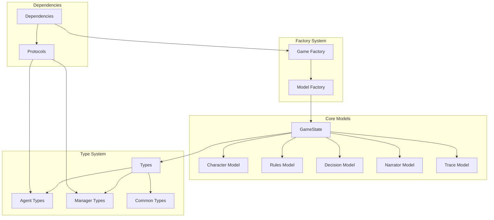
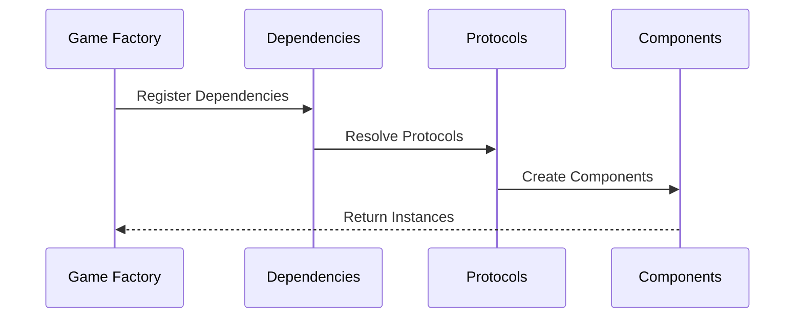

# Models Architecture

!!! abstract "Overview"
    The models layer provides the core data structures, type definitions, and dependency system that forms the foundation of CASYS RPG. It implements a robust type system using Pydantic v2 for validation and serialization.

## Architecture Overview



## Core Components

### Game State

The central state model managing all game data:

* **Structure**
    * Immutable state design
    * Version control
    * Event tracking
    * Validation rules

* **Components**
    * Character state
    * Game rules
    * Decision history
    * Narrative context
    * System metadata

### Domain Models

Specialized models for different aspects of the game:

=== "Character Model"
    * **Features**
        * Attributes
        * Inventory
        * Skills
        * Status effects
    
    * **Validation**
        * Attribute constraints
        * State transitions
        * Inventory limits
        * Skill requirements

=== "Rules Model"
    * **Features**
        * Game mechanics
        * Constraints
        * Actions
        * Conditions
    
    * **Validation**
        * Rule consistency
        * Action validity
        * State transitions
        * Condition checking

=== "Decision Model"
    * **Features**
        * Choice structure
        * Outcomes
        * Conditions
        * Analysis results
    
    * **Validation**
        * Choice validity
        * Outcome consistency
        * Condition logic
        * State transitions

## Type System

The type system provides strong typing and validation:

```python
from typing import Union, Protocol, TypeVar

# Type variables
T = TypeVar('T')
StateType = TypeVar('StateType', bound='GameState')

# Protocol definitions
class ManagerProtocol(Protocol):
    """Base protocol for all managers."""
    async def initialize(self) -> None: ...
    async def process(self, context: T) -> T: ...

# Type aliases
ManagerTypes = Union[
    StateManagerProtocol,
    CacheManagerProtocol,
    RulesManagerProtocol,
    DecisionManagerProtocol,
    NarratorManagerProtocol
]
```

### Type Categories

=== "Agent Types"
    * **Purpose**: Define agent interfaces and behaviors
    * **Components**:
        * Base agent protocol
        * Specialized agent types
        * Agent configurations
        * State definitions

=== "Manager Types"
    * **Purpose**: Define manager interfaces and behaviors
    * **Components**:
        * Manager protocols
        * Service types
        * Configuration types
        * State handlers

=== "Common Types"
    * **Purpose**: Shared type definitions
    * **Components**:
        * Base types
        * Enums
        * Utility types
        * State types

## Dependency System

The dependency system manages component relationships:



### Key Features

* **Protocol-Based Design**
    * Clear interfaces
    * Type safety
    * Dependency inversion
    * Easy testing

* **Dependency Resolution**
    * Automatic injection
    * Lifecycle management
    * Circular detection
    * Scoped instances

* **Service Management**
    * Component registration
    * Instance caching
    * Resource cleanup
    * Error handling

## Factory System

The factory system handles object creation and initialization:

=== "Game Factory"
    * **Purpose**: Creates and configures game components
    * **Features**:
        * Component creation
        * Dependency injection
        * Configuration loading
        * State initialization

=== "Model Factory"
    * **Purpose**: Creates model instances
    * **Features**:
        * Model validation
        * Default values
        * State initialization
        * Type checking

## Best Practices

1. **Model Design**
    * Use immutable models
    * Implement proper validation
    * Define clear interfaces
    * Handle edge cases

2. **Type Safety**
    * Use strict typing
    * Define protocols
    * Validate at boundaries
    * Handle type conversions

3. **Dependencies**
    * Follow SOLID principles
    * Use dependency injection
    * Manage lifecycles
    * Handle errors

4. **Performance**
    * Optimize validation
    * Use efficient serialization
    * Cache when appropriate
    * Monitor memory usage
