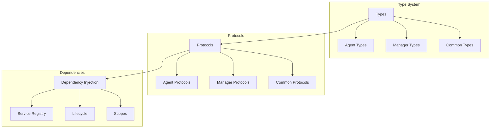

# Type System & Dependencies

!!! abstract "Overview"
    CASYS RPG uses a comprehensive type system with protocols and dependency injection to ensure type safety and maintainable code structure.

## Type Architecture



## Agent Types

### Base Types
```python
from typing import Protocol, TypeVar, Union

# Type variables
AgentType = TypeVar('AgentType', bound='BaseAgent')
StateType = TypeVar('StateType', bound='GameState')

# Agent protocols
class BaseAgentProtocol(Protocol):
    """Base protocol for all agents."""
    
    async def initialize(self) -> None: ...
    async def process(self, state: StateType) -> StateType: ...
    async def shutdown(self) -> None: ...
```

### Specialized Agents
```python
# Agent type unions
AgentTypes = Union[
    StoryGraphProtocol,
    RulesAgentProtocol,
    DecisionAgentProtocol,
    NarratorAgentProtocol,
    TraceAgentProtocol
]

# Agent configurations
class AgentConfig(BaseModel):
    """Configuration for agents."""
    
    name: str
    type: AgentTypes
    config: Dict[str, Any]
    dependencies: List[str]
```

## Manager Types

### Core Managers
```python
# Manager protocols
class ManagerProtocol(Protocol):
    """Base protocol for all managers."""
    
    async def initialize(self) -> None: ...
    async def process(self, context: Any) -> Any: ...
    async def shutdown(self) -> None: ...

# Manager types
ManagerTypes = Union[
    StateManagerProtocol,
    CacheManagerProtocol,
    WorkflowManagerProtocol,
    RulesManagerProtocol,
    DecisionManagerProtocol,
    NarratorManagerProtocol,
    CharacterManagerProtocol,
    TraceManagerProtocol
]
```

### Manager Configuration
```python
class ManagerConfig(BaseModel):
    """Configuration for managers."""
    
    name: str
    type: ManagerTypes
    config: Dict[str, Any]
    dependencies: List[str]
```

## Common Types

### Utility Types
```python
# Generic types
T = TypeVar('T')
Context = TypeVar('Context')
Result = TypeVar('Result')

# Common type aliases
JSON = Dict[str, Any]
Path = str
Timestamp = float
```

### State Types
```python
# State related types
class StateTypes:
    """Type definitions for state management."""
    
    StateUpdate = Dict[str, Any]
    StateChange = Tuple[str, Any]
    StateVersion = int
    StateMetadata = Dict[str, Any]
```

## Dependency System

### Service Registration
```python
class ServiceRegistry:
    """Manages service registration and resolution."""
    
    _services: Dict[str, Any] = {}
    _factories: Dict[str, Callable] = {}
    
    @classmethod
    def register(cls, name: str, service: Any) -> None:
        """Register a service."""
        cls._services[name] = service
        
    @classmethod
    def resolve(cls, name: str) -> Any:
        """Resolve a service."""
        return cls._services.get(name)
```

### Dependency Resolution
```python
class DependencyResolver:
    """Resolves dependencies for components."""
    
    async def resolve_dependencies(
        self,
        component: Any,
        config: Dict[str, Any]
    ) -> None:
        """Resolve and inject dependencies."""
        
        for dep_name in config.get('dependencies', []):
            # Get dependency
            dependency = await self._get_dependency(dep_name)
            
            # Inject dependency
            setattr(component, dep_name, dependency)
```

### Lifecycle Management
```python
class ComponentLifecycle:
    """Manages component lifecycle."""
    
    async def initialize_component(
        self,
        component: Any,
        config: Dict[str, Any]
    ) -> None:
        """Initialize a component with dependencies."""
        
        # Resolve dependencies
        await self.resolver.resolve_dependencies(
            component,
            config
        )
        
        # Initialize component
        if hasattr(component, 'initialize'):
            await component.initialize()
```

## Best Practices

1. **Type Safety**
    * Use strict typing
    * Define clear protocols
    * Implement proper validation
    * Handle type conversions

2. **Protocol Design**
    * Single responsibility
    * Clear interfaces
    * Proper abstraction
    * Version compatibility

3. **Dependency Management**
    * Clear dependencies
    * Proper injection
    * Lifecycle handling
    * Error management

4. **Performance**
    * Efficient resolution
    * Proper caching
    * Resource management
    * Memory optimization

## Integration

### With Models
* Type validation
* Model conversion
* State management
* Error handling

### With Agents
* Protocol implementation
* Type checking
* Dependency injection
* State handling

### With Managers
* Service resolution
* Resource management
* State coordination
* Error propagation
