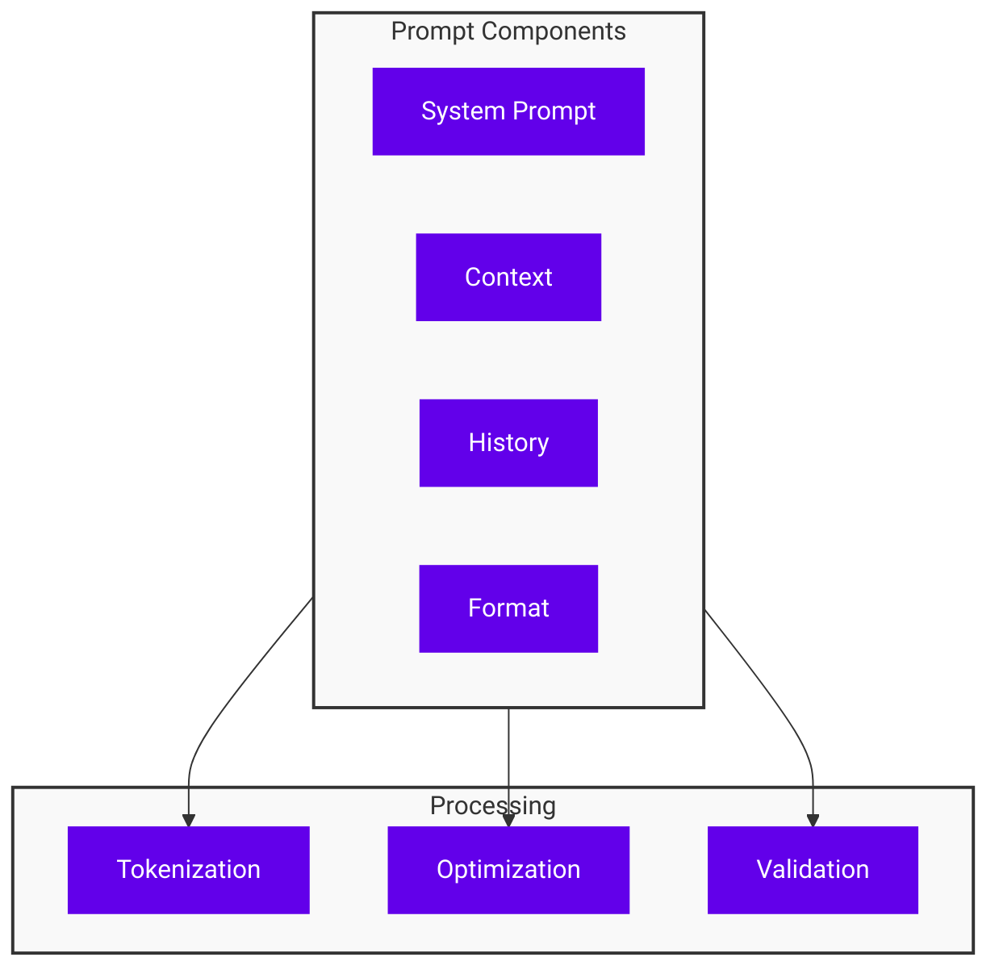
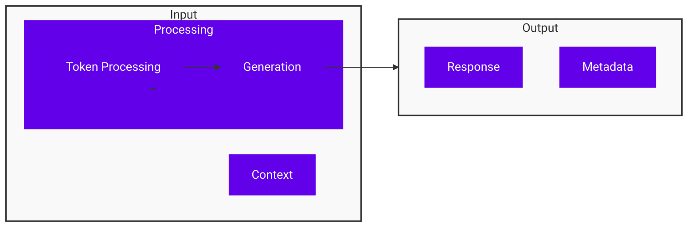
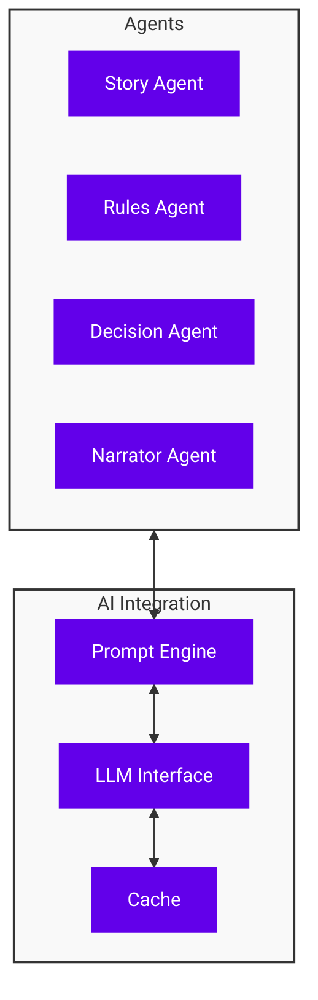

# AI Integration

!!! abstract "Overview"
    Deep dive into AI integration capabilities of CASYS RPG, including custom models, advanced processing, and optimization techniques.

## Language Models

### Model Configuration

```python
class ModelConfig:
    """Language model configuration."""
    model_name: str = "gpt-4o-mini"
    temperature: float = 0.7
    max_tokens: int = 2048
    stop_sequences: List[str] = []
    
    class Prompts:
        system: str = "You are a game master..."
        context: str = "Current game state..."
        format: str = "Response format..."
```

* **Model Selection**
    * Model capabilities
    * Performance characteristics
    * Resource requirements

* **Parameter Tuning**
    * Temperature
    * Token limits
    * Response formatting

### Prompt Engineering



* **Prompt Structure**
    * System prompts
    * Context injection
    * Response formatting

* **Optimization**
    * Token efficiency
    * Context management
    * Response quality

## Advanced Processing

### Context Management

```python
class ContextManager:
    """Manages AI context and history."""
    def __init__(self, max_tokens: int = 4096):
        self.history: List[Message] = []
        self.max_tokens = max_tokens
        
    def add_message(self, message: Message):
        """Add message while managing context window."""
        while self.total_tokens > self.max_tokens:
            self.history.pop(0)
        self.history.append(message)
```

* **Context Window**
    * Size management
    * History pruning
    * Relevance scoring

* **Memory Management**
    * Short-term memory
    * Long-term storage
    * Context retrieval

### Response Generation



* **Generation Pipeline**
    * Input processing
    * Response generation
    * Output formatting

* **Quality Control**
    * Response validation
    * Format checking
    * Error handling

## Custom Agents

### Agent Configuration

```python
class AgentConfig:
    """AI agent configuration."""
    name: str
    role: str
    capabilities: List[str]
    model_config: ModelConfig
    prompt_templates: Dict[str, str]
    
    def get_prompt(self, context: Dict) -> str:
        """Generate contextualized prompt."""
        template = self.prompt_templates[context["type"]]
        return template.format(**context)
```

* **Agent Types**
    * Specialized roles
    * Custom behaviors
    * Integration points

* **Configuration**
    * Model settings
    * Prompt templates
    * Processing rules

### Integration Points



* **Communication**
    * Inter-agent messaging
    * State sharing
    * Event handling

* **Coordination**
    * Task distribution
    * Resource management
    * Error handling

## Performance Optimization

### Caching

```python
class ResponseCache:
    """Caches AI responses."""
    def __init__(self, capacity: int = 1000):
        self.cache = LRUCache(capacity)
        
    def get_response(self, prompt: str) -> Optional[str]:
        """Get cached response if available."""
        key = self.hash_prompt(prompt)
        return self.cache.get(key)
```

* **Cache Strategies**
    * Response caching
    * Context caching
    * Cache invalidation

* **Optimization**
    * Memory usage
    * Response time
    * Resource efficiency

### Async Processing

* **Parallel Processing**
    * Task distribution
    * Resource management
    * Result aggregation

* **Queue Management**
    * Priority queues
    * Rate limiting
    * Error handling

## Best Practices

### Development

1. **Code Organization**
    * Clear structure
    * Documentation
    * Testing

2. **Error Handling**
    * Graceful degradation
    * Error recovery
    * Logging

### Deployment

1. **Resource Management**
    * CPU usage
    * Memory allocation
    * API quotas

2. **Monitoring**
    * Performance metrics
    * Error tracking
    * Usage statistics

## Next Steps

- Explore [State Management](state-management.md)
- Learn about [Custom Agents](custom-agents.md)
- Review [Technical Documentation](../../architecture/index.md)
