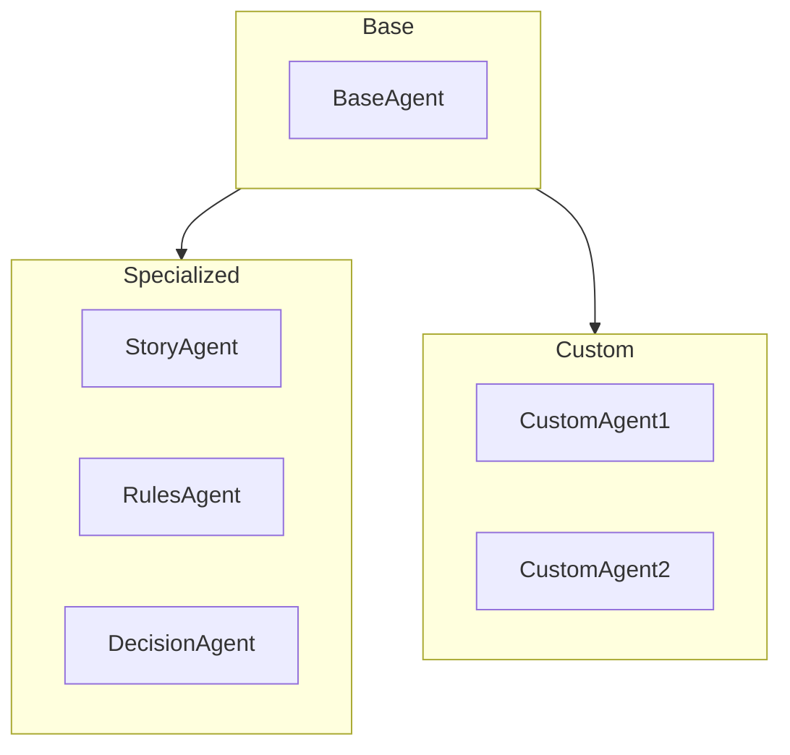
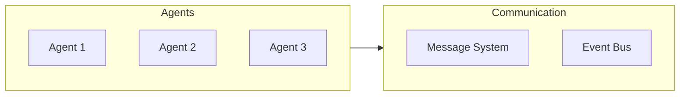
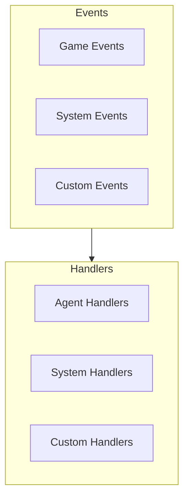
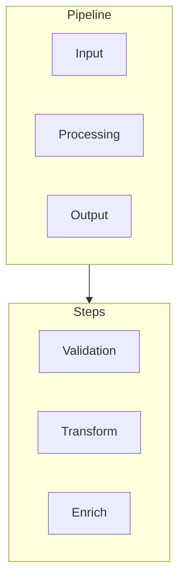

# Custom Agents

!!! abstract "Overview"
    Learn how to create and integrate custom agents into CASYS RPG's multi-agent system.

## Agent Architecture

### Base Agent

```python
class BaseAgent:
    """Base class for all agents."""
    def __init__(
        self,
        name: str,
        config: AgentConfig,
        manager: AgentManager
    ):
        self.name = name
        self.config = config
        self.manager = manager
        
    async def process(
        self,
        context: Dict[str, Any]
    ) -> AgentResponse:
        """Process agent request."""
        raise NotImplementedError
```

* **Core Components**
    * Agent identity
    * Configuration
    * Processing logic

* **Integration**
    * Manager connection
    * Event handling
    * State access

### Agent Types



## Agent Development

### Creating Custom Agents

```python
class CustomAgent(BaseAgent):
    """Custom agent implementation."""
    def __init__(
        self,
        name: str,
        config: AgentConfig,
        manager: AgentManager,
        **kwargs
    ):
        super().__init__(name, config, manager)
        self.custom_config = kwargs.get('custom_config', {})
        
    async def process(
        self,
        context: Dict[str, Any]
    ) -> AgentResponse:
        """Custom processing logic."""
        # Implement custom logic
        result = await self._process_custom(context)
        return AgentResponse(
            agent=self.name,
            result=result
        )
```

* **Implementation**
    * Core logic
    * State handling
    * Error management

* **Configuration**
    * Custom settings
    * Processing rules
    * Integration points

### Agent Communication



* **Message Passing**
    * Direct messages
    * Broadcast events
    * State updates

* **Coordination**
    * Task distribution
    * Resource sharing
    * Synchronization

## Integration

### Agent Manager

```python
class AgentManager:
    """Manages agent lifecycle and communication."""
    def __init__(self):
        self.agents: Dict[str, BaseAgent] = {}
        self.event_bus = EventBus()
        
    def register_agent(
        self,
        agent: BaseAgent
    ):
        """Register new agent."""
        self.agents[agent.name] = agent
        self.event_bus.subscribe(agent)
```

* **Management**
    * Agent registration
    * Lifecycle control
    * Resource management

* **Coordination**
    * Task routing
    * Event distribution
    * State synchronization

### Event System



* **Event Types**
    * System events
    * Game events
    * Custom events

* **Event Handling**
    * Event routing
    * Processing
    * Error handling

## Advanced Features

### State Management

```python
class AgentState:
    """Agent state management."""
    def __init__(self):
        self.state: Dict[str, Any] = {}
        self.history: List[Dict] = []
        
    def update_state(
        self,
        updates: Dict[str, Any]
    ):
        """Update agent state."""
        self.history.append(self.state.copy())
        self.state.update(updates)
```

* **State Types**
    * Internal state
    * Shared state
    * History

* **State Operations**
    * Updates
    * Validation
    * Persistence

### Processing Pipeline



* **Pipeline Steps**
    * Input validation
    * Processing
    * Output formatting

* **Customization**
    * Custom steps
    * Middleware
    * Hooks

## Best Practices

### Development

1. **Code Organization**
    * Clear structure
    * Documentation
    * Testing

2. **Error Handling**
    * Graceful degradation
    * Error recovery
    * Logging

### Deployment

1. **Resource Management**
    * Memory usage
    * CPU utilization
    * Communication overhead

2. **Monitoring**
    * Performance metrics
    * Error tracking
    * Usage statistics

## Next Steps

- Explore [AI Integration](ai-integration.md)
- Learn about [State Management](state-management.md)
- Review [Technical Documentation](../../architecture/index.md)
