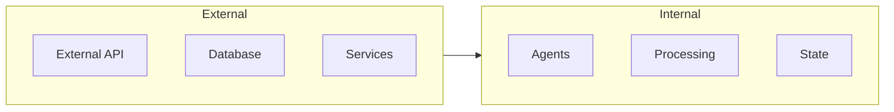

# Advanced Features

!!! abstract "Overview"
    Explore advanced features and capabilities of CASYS RPG for power users and developers who want to extend the system.

## Advanced Topics

=== "AI Integration"
    * **Custom Language Models**
        * Model configuration
        * Prompt engineering
        * Response optimization

    * **Agent Customization**
        * Custom behaviors
        * Specialized processing
        * Advanced integration

    * [Learn More](ai-integration.md)

=== "State Management"
    * **Complex States**
        * State composition
        * State validation
        * State transitions

    * **State Patterns**
        * Immutable states
        * State machines
        * Event sourcing

    * [Learn More](state-management.md)

=== "Custom Agents"
    * **Agent Development**
        * Agent architecture
        * Communication
        * Integration

    * **Specialized Agents**
        * Custom behaviors
        * New capabilities
        * System integration

    * [Learn More](custom-agents.md)

## Advanced Use Cases

### Complex Game Mechanics

```mermaid
graph TD
    subgraph Game Logic
        SM[State Machine] --> EV[Events]
        EV --> RU[Rules]
        RU --> AC[Actions]
    end
    
    subgraph Processing
        AI[AI Processing]
        VA[Validation]
        TR[Transitions]
    end
    
    Game Logic --> Processing
```

* **State Machines**
    * Complex transitions
    * Validation rules
    * Event handling

* **Custom Rules**
    * Rule definition
    * Rule processing
    * Rule chaining

### Advanced AI Features

* **Custom Models**
    * Model selection
    * Parameter tuning
    * Performance optimization

* **Complex Processing**
    * Multi-step processing
    * Context management
    * Response generation

### System Integration



* **API Integration**
    * Custom endpoints
    * Data transformation
    * Error handling

* **Service Integration**
    * External services
    * Data synchronization
    * State management

## Performance Optimization

### Caching Strategies

* **State Caching**
    * Cache levels
    * Invalidation
    * Synchronization

* **Response Caching**
    * Cache policies
    * Cache management
    * Performance tuning

### Async Processing

* **Parallel Processing**
    * Task distribution
    * Resource management
    * Synchronization

* **Event Processing**
    * Event queues
    * Processing strategies
    * Error handling

## Security Considerations

### Authentication

* **Custom Auth**
    * Auth providers
    * Token management
    * Session handling

* **Authorization**
    * Permission models
    * Access control
    * Role management

### Data Protection

* **Encryption**
    * Data encryption
    * Key management
    * Secure storage

* **Validation**
    * Input validation
    * Output sanitization
    * Security checks

## Next Steps

- Explore [AI Integration](ai-integration.md)
- Learn about [State Management](state-management.md)
- Create [Custom Agents](custom-agents.md)
- Review [Technical Documentation](../../architecture/index.md)
