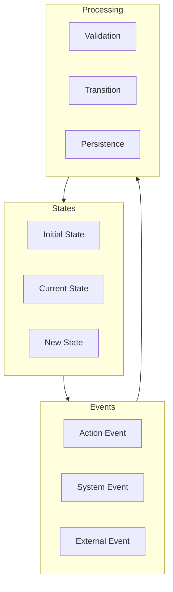
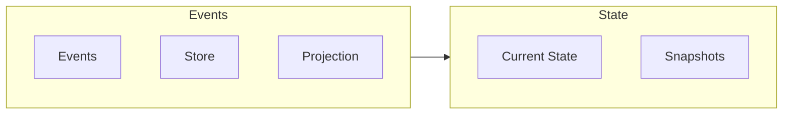

# State Management

!!! abstract "Overview"
    Advanced state management techniques in CASYS RPG, including state machines, immutable states, and event sourcing.

## State Architecture

### State Structure

```python
class GameState(BaseModel):
    """Immutable game state."""
    game_id: str
    player: PlayerState
    world: WorldState
    narrative: NarrativeState
    metadata: Dict[str, Any]
    
    class Config:
        frozen = True  # Immutable state
```

* **State Components**
    * Core state
    * Derived state
    * Metadata

* **State Validation**
    * Schema validation
    * Business rules
    * State integrity

### State Flow



## Advanced Patterns

### State Machine

```python
class GameStateMachine:
    """Game state machine implementation."""
    def __init__(self):
        self.states: Dict[str, State] = {}
        self.transitions: Dict[str, List[Transition]] = {}
        
    def add_transition(
        self,
        from_state: str,
        to_state: str,
        condition: Callable,
        action: Callable
    ):
        """Add state transition."""
        transition = Transition(to_state, condition, action)
        self.transitions[from_state].append(transition)
```

* **States**
    * State definition
    * State validation
    * State relationships

* **Transitions**
    * Transition rules
    * Guards
    * Actions

### Event Sourcing



* **Event Store**
    * Event persistence
    * Event replay
    * Snapshots

* **Projections**
    * State rebuilding
    * View models
    * Caching

## State Management

### Immutable States

```python
@dataclass(frozen=True)
class PlayerState:
    """Immutable player state."""
    id: str
    name: str
    attributes: FrozenDict[str, int]
    inventory: FrozenList[Item]
    
    def with_updates(self, **updates) -> 'PlayerState':
        """Create new state with updates."""
        current = self.__dict__
        return PlayerState(**{**current, **updates})
```

* **Benefits**
    * Thread safety
    * Predictability
    * Debugging

* **Implementation**
    * Immutable classes
    * Copy-on-write
    * State updates

### State Updates

```mermaid
graph TD
    subgraph Update Flow
        OS[Old State]
        UP[Update]
        NS[New State]
        VA[Validation]
    end
    
    subgraph Side Effects
        EV[Events]
        NO[Notifications]
        LO[Logging]
    end
    
    Update Flow --> Side Effects
```

* **Update Process**
    * State creation
    * Validation
    * Persistence

* **Side Effects**
    * Event generation
    * Notifications
    * Logging

## Performance Optimization

### Caching

```python
class StateCache:
    """State caching system."""
    def __init__(self, capacity: int = 1000):
        self.cache = LRUCache(capacity)
        self.snapshots: Dict[str, GameState] = {}
        
    def get_state(self, state_id: str) -> Optional[GameState]:
        """Get cached state if available."""
        return self.cache.get(state_id)
```

* **Cache Strategies**
    * Full state
    * Partial state
    * Derived data

* **Cache Management**
    * Invalidation
    * Synchronization
    * Memory usage

### Async Processing

* **Parallel Updates**
    * Concurrent processing
    * Resource management
    * Synchronization

* **Event Processing**
    * Event queues
    * Processing strategies
    * Error handling

## Best Practices

### Development

1. **Code Organization**
    * Clear structure
    * Documentation
    * Testing

2. **Error Handling**
    * State validation
    * Error recovery
    * Logging

### Deployment

1. **Resource Management**
    * Memory usage
    * CPU utilization
    * Storage optimization

2. **Monitoring**
    * State metrics
    * Performance tracking
    * Error monitoring

## Next Steps

- Explore [Custom Agents](custom-agents.md)
- Learn about [AI Integration](ai-integration.md)
- Review [Technical Documentation](../../architecture/index.md)
