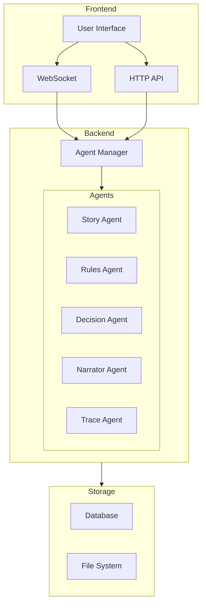
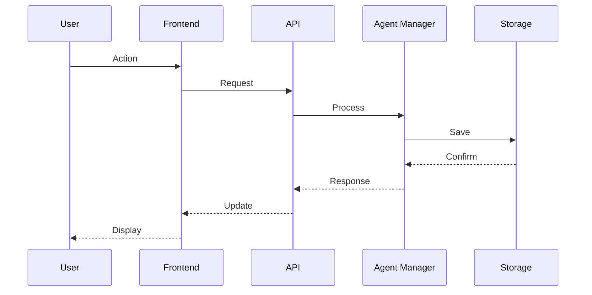
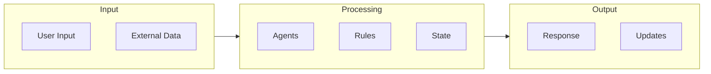

# Architecture Overview

!!! abstract "Overview"
    A high-level view of CASYS RPG's architecture, designed for developers who want to understand the system without diving into technical details.

## System Overview

## Key Components

### Frontend Layer

* **User Interface**
    * SvelteKit framework
    * Responsive design
    * Real-time updates

* **Communication**
    * WebSocket for live updates
    * REST API for CRUD operations
    * State synchronization

### Backend Layer

* **API Layer**
    * FastAPI framework
    * WebSocket support
    * Request handling

* **Agent System**
    * Multi-agent architecture
    * Specialized agents
    * Coordinated processing

### Storage Layer

* **Data Storage**
    * State persistence
    * Game assets
    * Player data

## System Flow

## Design Principles

### Clean Architecture

* **Separation of Concerns**
    * Clear boundaries
    * Independent layers
    * Clean interfaces

* **Dependency Management**
    * Inversion of control
    * Dependency injection
    * Clear dependencies

### Event-Driven Design

* **Event System**
    * Message passing
    * State updates
    * Action processing

* **Async Processing**
    * Non-blocking operations
    * Parallel execution
    * Resource efficiency

## Integration Points

### External Systems

* **API Integration**
    * Clear interfaces
    * Version control
    * Documentation

* **Plugin System**
    * Extension points
    * Custom agents
    * System hooks

### Data Flow

## Best Practices

### Development

1. **Code Organization**
    * Clear structure
    * Consistent patterns
    * Documentation

2. **Testing**
    * Unit tests
    * Integration tests
    * Performance tests

### Deployment

1. **Environment Setup**
    * Configuration
    * Dependencies
    * Security

2. **Monitoring**
    * Logging
    * Metrics
    * Alerts

## Next Steps

- Explore [Technical Architecture](../../architecture/index.md)
- Learn about [Advanced Features](../advanced/index.md)
- Try [Tutorials](../tutorials/index.md)
