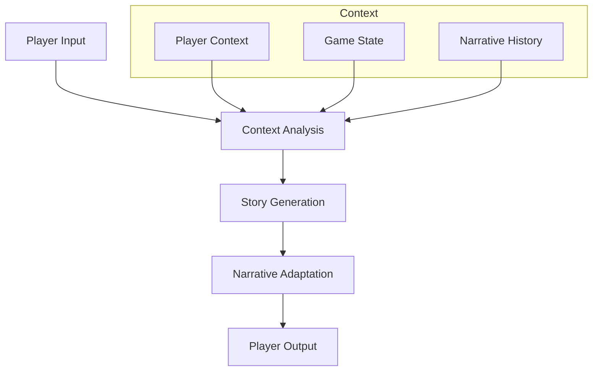
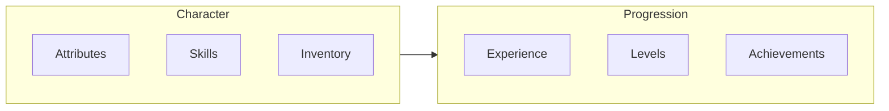
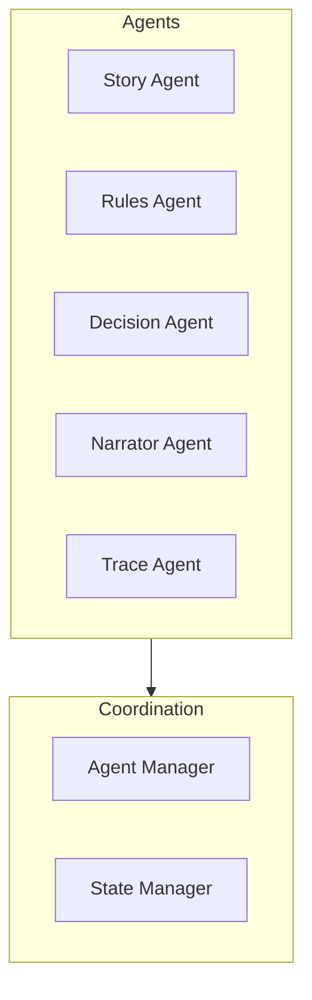

# Core Features

!!! abstract "Overview"
    Explore the core features that make CASYS RPG a powerful and flexible game engine.

## AI-Powered Storytelling

### Dynamic Narratives

* **Adaptive Story Progression**
    * Dynamic plot development
    * Contextual branching
    * Player-driven narratives

* **Intelligent Response System**
    * Natural language understanding
    * Context-aware responses
    * Emotional intelligence

* **Narrative Consistency**
    * Story coherence
    * Character consistency
    * World-building integrity

## Game Systems

### Character Management

* **Character Development**
    * Attribute system
    * Skill progression
    * Equipment management

* **Progress Tracking**
    * Experience points
    * Level progression
    * Achievement system

### Decision System

* **Choice Architecture**
    * Meaningful decisions
    * Multiple paths
    * Consequence tracking

* **State Management**
    * Game state tracking
    * Context preservation
    * History management

## Technical Features

### Multi-Agent Architecture

* **Agent Specialization**
    * Focused responsibilities
    * Clear interfaces
    * Efficient coordination

* **System Integration**
    * Clean architecture
    * Modular design
    * Easy extension

### Real-Time Updates

* **WebSocket Communication**
    * Instant updates
    * Bidirectional communication
    * State synchronization

* **Event System**
    * Event-driven architecture
    * Real-time notifications
    * State broadcasts

## Performance Features

### Optimization

* **Caching System**
    * State caching
    * Response caching
    * Resource optimization

* **Async Processing**
    * Non-blocking operations
    * Parallel processing
    * Efficient resource use

### Scalability

* **Modular Design**
    * Component isolation
    * Clear interfaces
    * Easy extension

* **Resource Management**
    * Memory efficiency
    * CPU optimization
    * I/O management

## Next Steps

- Learn about [Game Mechanics](game-mechanics.md)
- Explore the [Architecture Overview](architecture-overview.md)
- Try [Advanced Features](../advanced/index.md)
