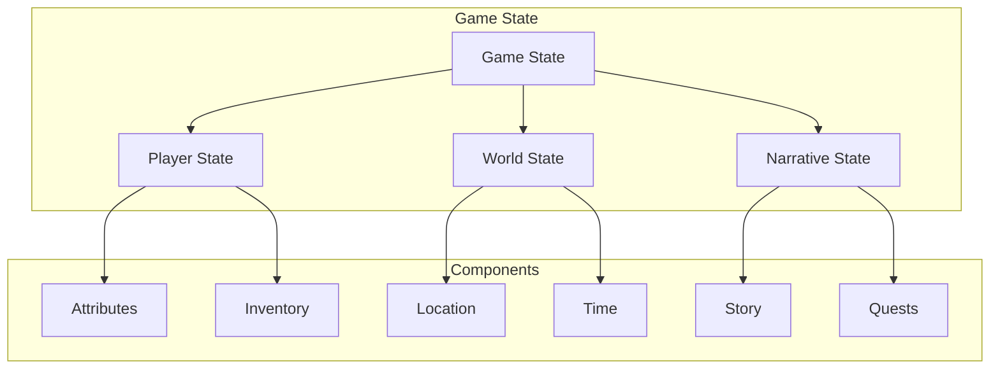
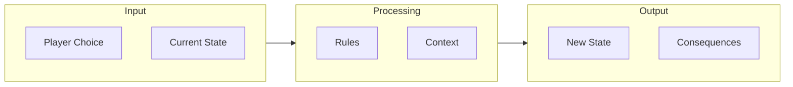
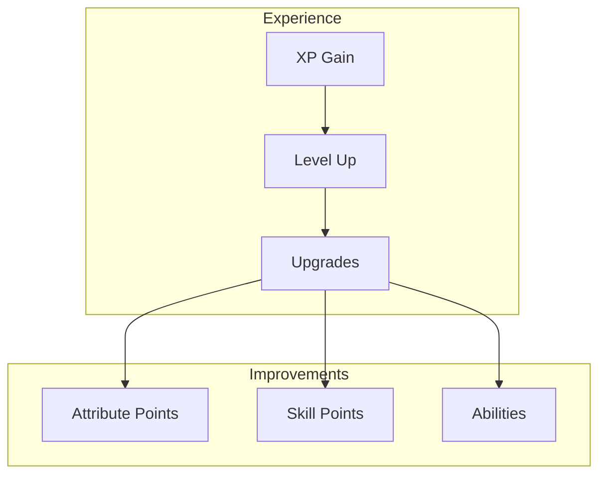
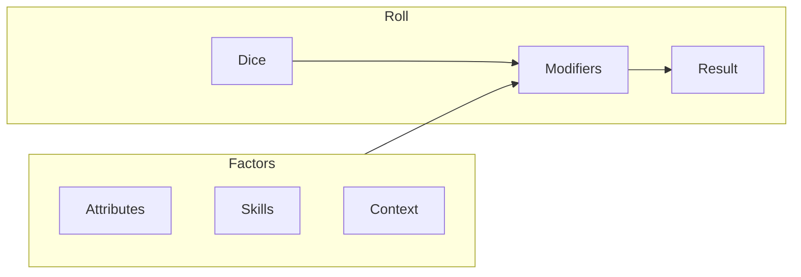
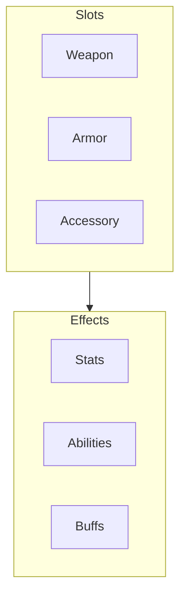
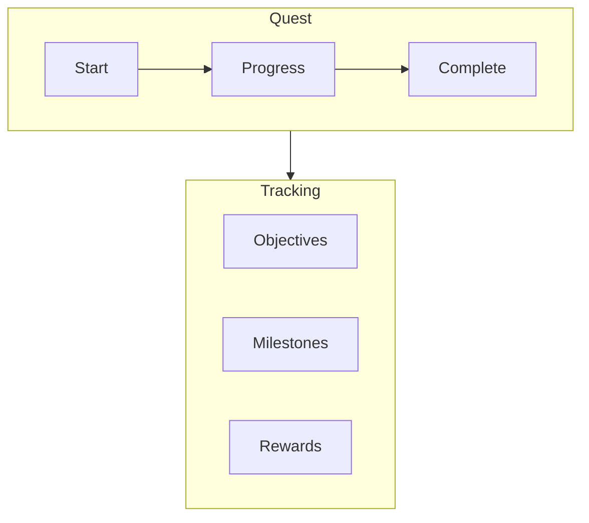

# Game Mechanics

!!! abstract "Overview"
    Understanding the core game mechanics that power CASYS RPG's interactive storytelling system.

## Core Systems

### State Management

* **State Types**
    * Game state
    * Player state
    * World state
    * Narrative state

* **State Operations**
    * State updates
    * State validation
    * State persistence

### Decision System

* **Choice Generation**
    * Context analysis
    * Option generation
    * Validation

* **Consequence Handling**
    * State updates
    * Narrative impacts
    * Long-term effects

## Character System

### Attributes

* **Core Stats**
    * Strength
    * Intelligence
    * Dexterity
    * Constitution

* **Derived Stats**
    * Health
    * Energy
    * Skills
    * Abilities

### Progression

* **Experience System**
    * XP gain
    * Level progression
    * Skill advancement

* **Character Development**
    * Attribute improvement
    * Skill learning
    * Ability unlocking

## Combat System

### Turn-Based Combat

* **Action Types**
    * Attack
    * Defend
    * Use item
    * Special ability

* **Combat Flow**
    * Initiative
    * Action selection
    * Resolution
    * Effects

### Dice System

* **Roll Types**
    * Skill checks
    * Combat rolls
    * Saving throws

* **Modifiers**
    * Attribute bonuses
    * Skill bonuses
    * Situational modifiers

## Inventory System

### Item Management

* **Item Types**
    * Equipment
    * Consumables
    * Quest items
    * Resources

* **Operations**
    * Acquire
    * Use
    * Combine
    * Trade

### Equipment

* **Equipment Slots**
    * Weapon
    * Armor
    * Accessories

* **Equipment Effects**
    * Stat modifications
    * Special abilities
    * Status effects

## Quest System

### Quest Management

* **Quest Types**
    * Main quests
    * Side quests
    * Dynamic events

* **Quest Components**
    * Objectives
    * Requirements
    * Rewards

### Progress Tracking

* **Progress Types**
    * Task completion
    * Collection
    * Achievement

* **Reward Types**
    * Experience
    * Items
    * Resources
    * Story progression

## Next Steps

- Try the [Tutorial](../tutorials/index.md)
- Explore [Advanced Features](../advanced/index.md)
- Read about [Technical Implementation](../../architecture/index.md)
