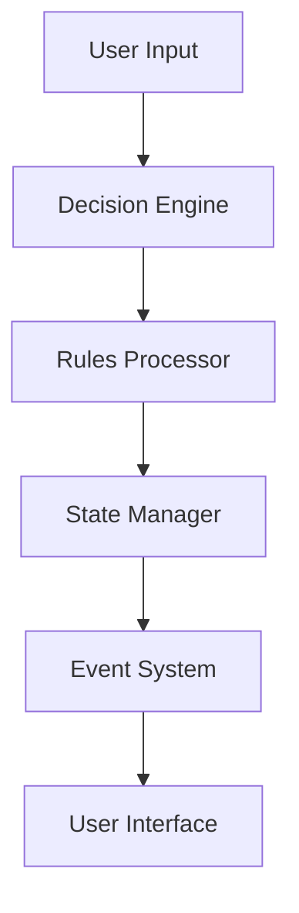

# Game Logic

This document details the core game logic of Casys RPG.

## Overview

The game logic in Casys RPG is handled by several interconnected components:

1. Game State Manager
2. Decision Engine
3. Rules Processor
4. Event System

## Game Flow



## Components

### Decision Engine

The Decision Engine processes user input and determines the next game state:

```python
class DecisionEngine:
    def process_decision(self, user_input: str) -> GameState:
        # Process user input
        # Apply game rules
        # Return new game state
```

### Rules Processor

Handles game rules and validates actions:

```python
class RulesProcessor:
    def validate_action(self, action: Action) -> bool:
        # Check action against rules
        # Return validity
```

### State Manager

Manages the game's current state:

```python
class StateManager:
    def update_state(self, new_state: GameState):
        # Update game state
        # Trigger events
```

## Event System

The event system manages game events and triggers:

```python
class EventSystem:
    def trigger_event(self, event: GameEvent):
        # Process event
        # Update UI
```

## Integration Points

- **User Interface**: Communicates through WebSocket and REST endpoints
- **State Management**: Uses Redis for state persistence
- **Rules Engine**: Integrates with FAISS for rule retrieval
- **Event System**: WebSocket-based real-time updates
