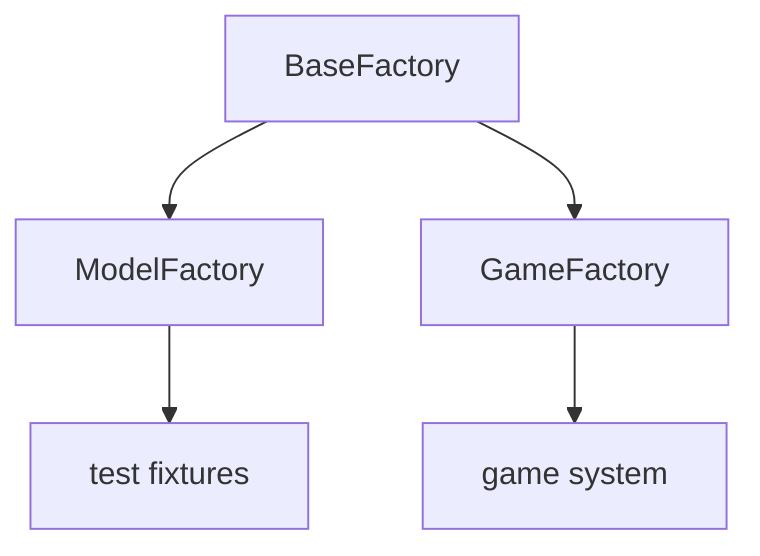
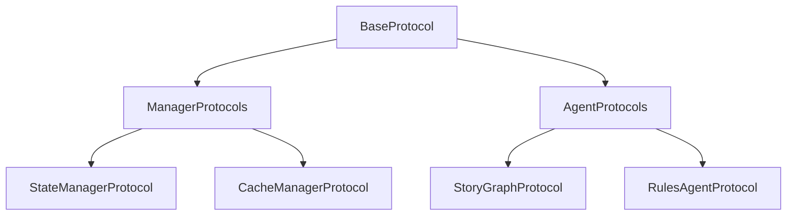
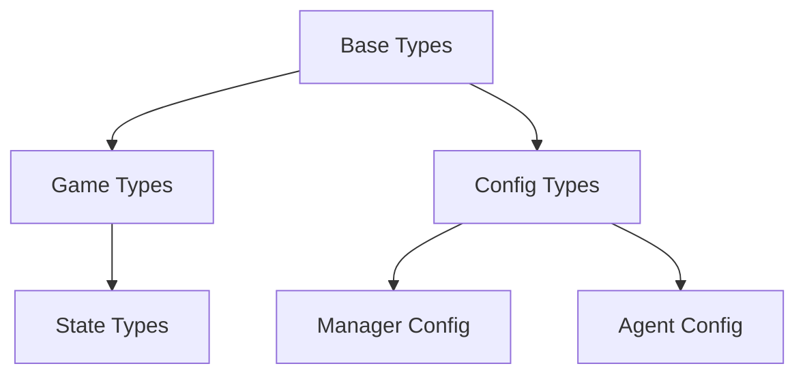
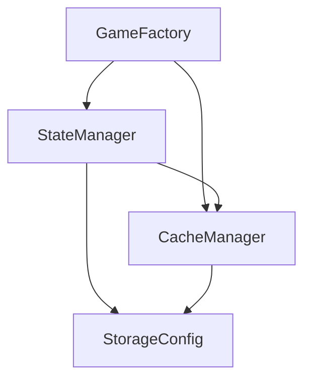

# Test Architecture Documentation

## Technical Components

### 1. Factory System

Le système de Factory est organisé en trois niveaux hiérarchiques :

#### BaseFactory
Fournit l'infrastructure de base pour la création d'objets avec :
- Gestion du cache
- Configuration par défaut
- Méthodes de création abstraites

#### ModelFactory
Spécialisé dans la création d'instances de modèles pour les tests :
- Hérite de BaseFactory
- Utilisé dans `tests/conftest.py` comme fixture globale
- Crée des instances valides avec des valeurs par défaut

#### GameFactory
Gère la création du système de jeu complet :
- Injection de dépendances automatique
- Validation des composants créés
- Cache intelligent des instances



### 2. Protocol System

Le système de protocoles définit les contrats d'interface pour tous les composants :

#### Hiérarchie


#### Caractéristiques Clés
- Définition des contrats d'interface pure
- Support des opérations asynchrones
- Validation des types au niveau protocole
- Pas d'implémentation concrète

Exemple minimal :
```python
class StateManagerProtocol(Protocol):
    """Illustre la structure d'un protocole."""
    async def get_state(self) -> GameState: ...
    async def update_state(self, state: GameState) -> None: ...
```

### 3. Type System

Le système de types s'organise en couches :

#### Structure
1. Types de Base
   - Enums personnalisés
   - Modèles de base avec validation
   - Types primitifs étendus

2. Types Composés
   - États de jeu
   - Configurations
   - Résultats de validation

3. Types Utilitaires
   - Validateurs
   - Convertisseurs
   - Types génériques



### 4. Dependency System

Le système de dépendances gère l'injection et la résolution des composants :

#### Architecture


#### Caractéristiques
- Résolution automatique des dépendances
- Configuration via décorateurs
- Support des singletons et de la création paresseuse
- Validation des dépendances circulaires

Exemple d'utilisation :
```python
@configured_dependency(singleton=True)
class StateManager:
    """Illustre l'injection de dépendances."""
    def __init__(self, cache_manager: CacheManagerProtocol):
        self.cache_manager = cache_manager
```

### 5. Test Infrastructure

L'infrastructure de test fournit :

#### Composants Clés
1. Gestion des Fixtures
   - Hiérarchie de fixtures
   - Portée configurable
   - Nettoyage automatique

2. Mock System
   - Mocks basés sur les protocoles
   - Réponses configurables
   - Validation des appels

3. Métriques
   - Collecte de métriques
   - Rapports de performance
   - Analyse des tests

#### Organisation
```
tests/
├── agents/              # Tests des agents
├── managers/           # Tests des managers
├── models/             # Tests des modèles
└── conftest.py         # Fixtures globales
```
